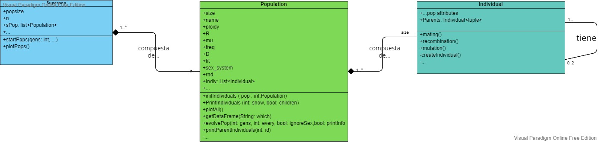

```{r setup, include=FALSE}
knitr::opts_chunk$set(echo = TRUE)
library(reticulate)
library(tinytex)
```

\begin{centering}
\vspace{3cm}
```{r uni_logo, echo=F, out.width="100%"}
knitr::include_graphics("files/uv.png")
```
\vspace{1cm}

\LARGE
{\bf Populy}

\Large
{\bf Un paquete en Python para enseñar biología evolutiva}

\vspace{1 cm}

\Large
{\bf Grado en Biotecnología}

\Large
{\bf Curso 2021/2022}

\vspace{1.5 cm}

\large
{\bf Modalidad: Trabajo de metodologías docentes}

\vspace{1cm}

\end{centering}

\large
\textbf{Autor:}

\large 
Mario Ruiz

\vspace{0.5 cm}

\large
\textbf{Tutor:}

\large
José Ignacio Lucas Lledó

\vspace{0.5 cm}
\normalsize
`r Sys.Date()`

\newpage
\renewcommand*\contentsname{Índice}
\tableofcontents
\newpage

# Glosario

OOP: Programación Orientada a Objetos, paradigma de la programación basada en la creación de objetos que contienen información y comportamiento determinados.

Diagrama de clases: tipo de diagrama que describe la estructura de un sistema formado por clases, donde se muestra los atributos, métodos y el tipo de relación entre éstas.

pip: instalador de paquetes de Python.


# Introducción

Tanto la genética como la evolución son dos asignaturas fundamentales para cualquier estudiante de ciencias de la vida, estos dos campos de estudio están estrechamente relacionados, normalmente bajo el término de genética de poblaciones. Esta es una rama de la biología que aspira al estudio de la variación de las características genéticas de una población a lo largo de las generaciones[*ref1*]. Los cambios en los loci, o lugares del genoma, se suelen expresar mediante variaciones en la frecuencia de cada uno de los alelos de estudio.

Estos cambios genéticos que se producen a lo largo de las generaciones en una población son muy lentos, ya que dependen de la vida promedio de una especie. Es por esto por lo que el campo de la genética de poblaciones y la biología evolutiva en general han sido predominantemente cuantitativas, requiriendo de planteamientos teóricos, métodos numéricos y simulaciones por ordenador para su estudio[@Servedio2014].

El estudio, tanto académico como formativo, de la biología evolutiva ha ido muy parejo con los avances tecnológicos por su propia naturaleza dilatada en el tiempo. Esto no ocurre con tanta relevancia en otros campos como puede ser la genética clásica o la biología celular, donde el abordaje experimental es mucho más viable por su inmediatez.

Además, diversos estudios muestran que la comprensión de los fundamentos teóricos quedan mejor integrados en el alumnado cuando se asimilan de forma activa. A modo general implica una interacción más directa con el contenido que se estudia más allá de lo que contiene el texto. Es bien sabido y está bien estudiado que plantear ejercicios o problemas durante una clase ayuda a afianzar los conceptos enseñados, esta es una forma básica, pero eficaz, de proporcionar un aprendizaje activo. Existen infinidad de formas distintas, plantear preguntas o incluso realizar experimentos sencillos son ejercicios que permiten al alumnado interactuar de alguna forma con la materia. A mayor nivel de interacción mejores son los resultados académicos.

Más relevante es este concepto de aprendizaje activo en la enseñanza de los conceptos de genética de poblaciones en las aulas; es posible plantear problemas pero difícilmente se puede plantear un experimento clásico en laboratorio para el estudio de los cambios genéticos en una población. Por esto se suelen utilizar programas de simulaciones y/o aproximaciones numéricas, ya que facilitan la comprensión de los fenómenos clave que tienen lugar en la evolución de las especies de forma casi instantánea, normalmente mediante la obtención de gráficos y tablas de frecuencias; es por ello por lo que se utilizan varias de estas herramientas de simulación y visualización de la evolución en las aulas. No solo eso, sino que el avance en la capacidad de computación de los ordenadores personales permiten obtener simulaciones más realistas, así como estudiar fenómenos más complejos de forma relativamente sencilla. 

El potencial de estas herramientas de forma pedagógica es inmenso ya que permite a un alumno realizar un experimento de forma virtual, no solo eso, si no que además puede obtener unos resultados gráficos y compararlos. La comparación de resultado esperado frente a resultado obtenido es muy importante ya que permite a la persona deshacerse de falsas creencias o preconcepciones erróneas de una materia. También puede promover la curiosidad casi científica de averiguar el porqué de ese resultado, todo esto mientras se aprende lo estudiado.

Populus, desarrollado por la universidad de Minnesota[*ref6*], es una de estas herramientas de modelización de procesos evolutivos. Su objetivo principal enseñar biología evolutiva en las aulas. Con este mismo fin, Populus se ha utilizado ampliamente por muchas universidades del mundo durante décadas debido a que es un programa muy sencillo de instalar desde su web, así como de utilizar. Consiste de una única interfaz gráfica con un pequeño menú donde seleccionar el tipo de "evento" evolutivo. Una vez seleccionado aparece una nueva ventana puedes ajustar algún parámetro del modelo; al final se obtiene el gráfico en una ventana adyacente, tal y como muestra la siguiente imagen.


Tanto Populus como otras herramientas similares supusieron una gran revolución a la hora de enseñar conceptos de biología ya que permitía una forma novedosa y rápida de interacción con los conceptos clave. Sin embargo, con el paso de los años, el programa no se ha adaptado ni a las necesidades educativas de los alumnos de hoy en día ni a los avances en el campo de la programación.

Populus es un programa que ya no supone una novedad en su uso, los alumnos están acostumbrados al manejo constante de programas y aplicaciones mucho más complejas y sofisticadas en su día a día. 
Su interfaz es extremadamente simple, esto hace que el usuario pueda obtener un gráfico cualquiera simplemente pulsando un par botones, sin comprender exactamente cuál es el proceso subyacente. Para asimilar conceptos es necesario que ocurra una interacción real entre el software y la persona, en muchas ocasiones esto es útil si lo que se busca es un producto o programa convencional, sin embargo en el ámbito de la enseñanza es muy superficial. 
Si a un alumno se le plantea un problema que debe resolver con este programa el estudiante simplemente accederá a la aplicación y obtendrá el gráfico que se buscaba. Tal y como se ha comentado anteriormente, esto no estimula la curiosidad porque, por su simpleza, es muy complicado equivocarse a la hora de utilizarlo o plantear un problema que suponga un verdadero reto al alumno.

La interactividad con un programa es un paso necesario al hablar de aprendizaje, de la misma manera que ocurre en la vida real al aprender a usar herramientas. El usuario, alumno en este caso, primero debe familiarizarse con esa nueva herramienta para conocer lo que puede y no puede hacer; incluso hasta cómo funciona o por qué lo hace. Una vez aprehendido, el usuario podrá utilizarla de una mejor forma, y podrá interpretar mejor lo que está ocurriendo.

Cuando interactividad se reduce a la mínima expresión todo este proceso de aprendizaje previo se reduce, esto lleva a que el usuario lleve a cabo el proceso con éxito, pero sin comprender el propio modelo, sin explorar las limitaciones de ésto e incluso sin curiosidad en cómo se ha llevado a cabo. Esto resulta, en definitiva, en un aprendizaje mermado y deficiente.

Este déficit en el aprendizaje es, además, muy difícil de encontrar y solventar hasta que ya es tarde. Al fin y al cabo, el alumno ha podido realizar la tarea o problema pedida con éxito y en tan solo unos minutos, es normal que el profesor asuma que los alumnos han comprendido hasta cierto punto el fundamento teórico que subyace al modelo, sin embargo este problema se debe al propio programa por lo comentado anteriormente. La sencillez crea una falsa ilusión de comprensión, del mismo modo que utilizar un microscopio no hace que comprendas lo que observas, ni el propio funcionamiento del microscopio.

A todo esto se le suma otro factor: la importancia de la programación. La programación está tomando cada vez más relevancia en la sociedad debido a la digitalización de la mayoría de procesos, también en el mundo académico donde se utilizan con mucha frecuencia diversos lenguajes de programación para llevar a cabo tareas muy repetitivas o tediosas, además sirve para enseñar conceptos e incluso otra forma de pensar. Conocer, aunque sea de forma superficial, un lenguaje de programación es tremendamente útil. 

Hace años suponía un gran obstáculo añadido, ya que lo que se buscaba era enseñar una materia en concreto, y muchos alumnos no tenían un ordenador en sus casas. En la actualidad, los alumnos pueden desenvolverse con facilidad en los ordenadores por lo que introducirlos en el mundo de la programación a través de programas de este estilo proporciona un doble beneficio. Por un lado, permite obtener un conocimiento que va más allá de la propia herramienta utilizada, por otro lado permite al alumnado aproximarse a un nuevo mundo como es el de la computación a través de conceptos familiares, en este caso la biología. Populus carece de todo esto al tener una interfaz gráfica sencilla, disponer al alumnado de una interacción más directa con el software no tiene por qué suponer un problema a día de hoy y puede permitir que el propio usuario conozca y se interese por lo que ocurre tras el "botón" que se pulsa. 

Por último, otro problema de Populus es su poca reproducibilidad. Tal y como se observa en la Figura(#Figura), el output es un gráfico sobre el cual es muy complicado obtener conclusiones, analizar el procedimiento y, en definitiva, entender el experimento virtual que se ha llevado a cabo. Para los estudiantes de ciencias, comprender el procedimiento es igual o más importante que los resultados, por lo que no permite estudiar los pasos llevados a cabo ya que estos están ocultos bajo la interfaz. 

Más allá de Populus existen otros simuladores de evolución como simuPop o SLiM, ambos programas surgen con una finalidad muy distinta a Populus aunque vienen a solucionar algunos de sus problemas. Sin embargo, ejecutar estos programas supone una barrera de entrada alta para usuarios inexpertos debido a que su funcionamiento requiere de ciertos conocimientos en programación, y para ello es necesario saber como instalar un intérprete, cómo y dónde descargar el programa, entre otros obstáculos que dificultan su uso.

La genética de poblaciones es un campo que puede aprovechar bien los avances técnicos para brindar una aprendizaje adecuado, contextualizado e interdisciplinar de sus conceptos. 

## Objetivos

Bajo las premisas de aprender sobre procesos evolutivos e introducirse en la programación para estudiantes de ciencias biológicas nace Populy, un paquete de código abierto desarrollado en Python de simulación de procesos evolutivos. El paquete, aunque sencillo de utilizar, requiere de conceptos de programación básicos, es por ello por lo que también se han creado unos materiales adicionales que servirán como complemento al programa, permitiendo una interactividad mayor con el software, un aprendizaje dinámico de los conceptos clave de la programación y de los procesos fundamentales de la evolución de las especies.

Los objetivos de Populy son, por tanto:

- Aprender sobre los procesos fundamentales de la genética de poblaciones.
- Ofrecer un aprendizaje interactivo, evitando el uso de botones, para que el usuario deba experimentar las distintas posibilidades de resolver un problema.
- Sencillez de uso.
- Introducir a los estudiantes de biología a la programación. No se pretende enseñar a programar pero sí familiarizarse con algunos de los conceptos clave.
- Flexibilidad. El programa debe permitir modificaciones y cambios con el tiempo.

Al tratarse de un programa de código abierto el software se puede ser utilizado por cualquier persona. Además de esto, debido a su implementación, Populy puede adaptarse con el tiempo a los requerimientos de los alumnos, mejorando su funcionalidad e incluyendo nuevos tipos de simulaciones.

Mediante este paquete el usuario podrá invocar una o múltiples poblaciones, crear a sus individuos, hacerla evolucionar y obtener un *output* gráfico y tabular donde poder estudiar y comprender de forma más visual algunos de los mecanismos que se enseñan en las clases como son el equilibrio mutación-selección, la eficacia biológica en una población, la recombinación, la deriva genética, entre otros en menos de 10 lineas de código. Todo esto junto a una serie de explicaciones sobre el funcionamiento del paquete y de sus métodos clave, unos ejercicios o casos problema que podrán ser implementados o modificados en las aulas, permitiendo al estudiante un aprendizaje activo de los conceptos y una libertad mayor que la brindada por programas como Populus.


# Computación como herramienta educativa
## Alfabetización informática 

La biología se está alzando como la ciencia del siglo XXI: medicina personalizada[*ref1*], microoganismos superresistentes[*ref2*], ingeniería genética y mejora de organismos[*ref3*], descubrimiento de las estructuras tridimensionales de las proteínas[*ref4*] son solo algunos de los temas que están acaparando el panorama científico actual. Para mucha gente el siglo XXI es el siglo de la biología[@VENTER2004].
Aunque no existe un premio nobel de biología, la mayoría de los temas premiados tanto en medicina y fisiología, en química y hasta en física corresponden a investigaciones en el campo de la biología[-@nobel]. Los avances tecnológicos están permitiendo estudiar sistemas extremadamente complejos como lo son los biológicos, la criomicroscopía, el análisis de redes metabólicas.

Mencionando un ejemplo más concreto, de hace tan solo un año, se trata de *AlphaFold* 2, la herramienta de predicción de estructuras tridimensionales de proteínas de DeepMind basada en Inteligencia Artificial. Esta herramienta tiene sus bases en el aprendizaje profundo que se ha desarrollado casi en su totalidad desde hace menos de 10 años[*ref7*] y en este tiempo ha desbancado al resto de tecnologías tradicionales de predicción de la estructura proteica con tasas de aciertos iguales a los métodos experimentales[*ref8*].

La programación es una herramienta y como cualquier lenguaje natural requiere un cierto nivel de abstracción. Esta abstracción y "forma de ver el mundo" se le ha denominado pensamiento computacional[@Wing2008], siendo éste un subgrupo del denominado pensamiento analítico. La esencia de este modelo de pensamiento centrado en la abstracción y la automatización de procesos. De hecho, existe un debate público donde se le otorga el aprendizaje de la programación la misma importancia que aprender a escribir[*ref10*]. La capacidad de abstracción es un buen indicador de la capacidad de resolución de problemas[Bergmann1996].


El avance de las ciencias de la computación es casi exponencial, al igual que se enseña en las aulas como el mundo físico funciona varios autores defienden que debe enseñarse cómo el mundo virtual funciona y no solo a utilizarlo. Los alumnos pasan gran parte de su tiempo cara a las pantallas, utilizando programas, viendo vídeos, jugando. Se les ha enseñado a usarlo pero no qué los hace funcionar, más allá de los conceptos básicos.

La alfabetización informática es la capacidad de usar las herramientas informáticas para llevar a cabo tareas(). Esta alfabetización debe estar presente en todas las etapas de la vida y en todos los niveles educativos, se trata de dar a la persona la habilidad de usar las nuevas herramientas para que pueda desenvolverse correctamente en su entorno. Así pues, aunque todas las personas deben tener una alfabetización mínima no será para todos la misma. La educación debe adaptarse a estas nuevas tecnologías que permiten realizar de forma más eficiente, dinámica e interactiva muchas tareas que anteriormente resultaban tediosas e incluso imposibles de realizar.

El uso de las calculadoras, por ejemplo, es una de las habilidades propias de esta alfabetización, a día de hoy es raro ver algún estudiante que no haya usado calculadoras hasta para problemas de lo más sencillos, cuando hace 20 años esta herramienta era prácticamente inexistente en las aulas[*ref*]. Al contrario de lo que se cree, no existe una disminución en la inteligencia de la población, más bien lo contrario[*ref*]. Parte de este avance se debe al aprendizaje y uso de las herramientas informáticas correspondientes ya que permiten ahorrar tiempo y dedicar el esfuerzo a aquellas tareas que requieren de razonamiento, así como la presencia de nuevos estímulos y problemas.

La programación es una de estas herramientas, la programación ha existido desde hace siglos; ya en el siglo IX se describe una máquina que toca la flauta de forma automática [@Koetsier2001], sin embargo el primer programa surge en 1843 por Ada Lovelace desarrollado para la máquina analítica que nunca llegó a construirse. La programación va ligada a la creación y uso de las máquinas para instruirlas. Actualmente el objetivo es el mismo que hace cien años, comunicarse con una máquina para que lleve a cabo determinadas operaciones, es una forma de dar instrucciones que un ordenador pueda traducir a su propio lenguaje, para ejecutar una tarea. Con la ubicuidad de los ordenadores en los hogares y las aulas y la creación de multitud de lenguajes de programación de alto nivel y con sintaxis similar a la lengua humana surge la posibilidad y la necesidad de aprender a programar.


## Python 

Un lenguaje de programación es un tipo de lenguaje con estructura fuertemente definida que proporciona las herramientas necesarias (variables,estructuras de control, etc.) para implementar una serie de instrucciones que serán llevadas a cabo por un ordenador.

Existen multitud de lenguajes de programación, que se clasifican históricamente según dos criterios:
1. Nivel de abstracción: esto es, según la similitud al lenguaje empleado por los ordenadores, también conocido como lenguaje máquina. Se le denomina de alto nivel a un lenguaje con una sintaxis más abstracta, es decir, similar al lenguaje humano y menos dependiente del hardware de la máquina mientras que uno de bajo nivel es más similar al lenguaje máquina pero más dependiente.
2. Según el paradigma: aunque la mayoría de lenguajes de programación permiten llevar a cabo las mismas tareas e implementar los mismos algoritmos no todos lo hacen de la misma manera, existen diferentes formas de estructurar el código, los paradigmas más conocidos son Orientado a Objetos, funcional y multiparadigma.
3. Según su propósito: Aquellos con una utilidad muy restringida, pensados para una tarea concreta se conocen como lenguajes de propósito específico mientras que el resto son de propósito general

Python es un lenguaje de programación de alto nivel multiparadigma de propósito general, fue diseñado por Guido Van Rossum en 1991. El objetivo de este lenguaje es facilitar la interpretación del código, su aprendizaje y su uso. Sus pilares se describen en el libro zen de python.

Su facilidad de aprendizaje y la gran comunidad que tiene a su alrededor son algunos de los motivos por el cual Python es uno de los lenguajes más utilizados y con mayor proyección.

### ¿Por qué Python?

A la hora de desarrollar Populy la segunda pregunta, después de decidir el propósito del paquete, fue en qué lenguaje implementarlo. Existían dos posibilidades: R o Python. Ambos lenguajes son de alto nivel y multipropósito, tienen sintaxis similares y tipado dinámico. Sin embargo, R no es multipropósito. Este lenguaje fue creado por y para estatistas, su paradigma es principalmente el funcional: creación y uso de funciones de manera similara al comportamiento de las funciones matemáticas, y es ampliamente utilizado en campos como la ciencia de datos. 

Aunque Populy podría haberse desarrollado sin problemas en cualquier lenguaje, al final se hizo en Python debido a un mejor paradigma de orientación a objetos. Este paradigma de programación establece que gran parte del código, sino todo, debe estar encapsulado en Objetos, estas entidades deben tener un propósito común, es decir, cada objeto creado debe tener una características que lo definan. La interacción entre el código debe ser una interacción entre objetos siempre que sea posible.

Los objetos son una herramienta muy útil ya que permiten encapsular el código similar en bloques comunes, haciendo el programa más legible. Esto es lo que se buscaba a la hora de desarrollar Populy ya que el objetivo era crear una población que contendría unos individuos, mediante el paradigma de la orientación a objetos se entiende que tanto población como individuo deben ser dos clases de objetos distintas, que tendrán un tipo de relación determinada que les permitirá interactuar.

Primero hablar sobre los distintos tipos de lenguajes que existen, hacer una introducción a la programación orientada a objetos. Qué es python, que ventajas (ej: facil curva de aprendizaje, gran comunidad, multitud de paquetes y librerias) y posibles desventajas (menor rendimiento) tiene.
Hablar sobre la importancia de Python como lenguaje respecto al resto, el gran número de usuarios que tiene, la facilidad en su aprendizaje y su expansión en el mundo académico.
  
## Jupyter notebook 

El proyecto Jupyter es una colaboración para el desarrollo de herramientas de libre uso (open-source) para realizar análisis exploratorios y computacionales de forma interactiva. El proyecto Jupyter fue creado en 2014 a partir de Ipython* aunque actualmente soporta más de 100 lenguajes de programación diferentes[*r*]. Dentro del ecosistema Jupyter se encuentran las Jupyter notebooks o libretas jupyter, estas libretas son un entorno web que tuvo su origen en la facilidad de realizar y compartir análisis de datos. Sin embargo desde hace unos años esta herramienta se está empleando en las aulas con propósitos educativos de una gran variedad de formas distintas. 

La estructura externa de una libreta Jupyter es muy simple ya que consta de bloques de información, estos bloques pueden ser de texto, escrito en formato Markdown, o bloques de código tal y como se puede observar en la imagen adjunta [imagen](imagen). Las posibilidades que surgen de combinar estos dos elementos son varias, desde explicar de forma detallada un bloque de código, sin tener que recurrir a manuales externos o a libros, hasta la posibilidad de plantear problemas *in situ*. Por otra parte, los bloques de código no son estáticos, el usuario puede interactuar con ellos, ejecutarlos y observar los resultados reales en el momento, así como probar a cambiar ciertos parámetros del bloque o poder crear su propio código, todo en tiempo real y de una forma mucho más dinámica que la que ofrecen los métodos tradicionales, ya sea en un formato word/pdf estático, donde el usuario no puede interactuar con los resultados, o una interfaz gráfica de usuario como puede ser Populus, donde la estructura programática queda oculta a la persona.

Una libreta Jupyter es, por tanto, un documento interactivo, orientado a la computación, que permite crear una narrativa para explicar, analizar o enseñar conceptos. 

### Métodos de uso libreta Jupyter en el aula

Estas libretas se pueden utilizar igual que una presentación de PowerPoint, el profesor crea o utiliza una nueva libreta y en la misma clase puede compartirla a los alumnos para que ellos la ejecuten, al tiempo que se realiza una explicación más detallada de los conceptos. Esta forma de utilizarlo puede ser útil para introducir al alumnado al concepto de las libretas, se conoce como Shift-Enter, que es el comando utilizado para ejecutar un bloque de código. Esta forma, sin embargo, no explota todo el potencial que tienen las libretas Jupyter para la enseñanza.

El método más acorde con la filosofía de las libretas Jupyter es el de poder modificar el código y probar cosas nuevas, experimentar los cambios que se producen e interpretar tus propios resultados. Esto se puede lograr de diversas formas, la manera que se ha seguido a la hora de desarrollar las libretas para Populy es la de ejecución+modificación+problema. Este método consiste en la introducción de un concepto, junto al código necesario y más básico para llevarlo a cabo, tras esto el estudiante deberá realizar pequeños cambios al código y observar el cambio en los resultados o los errores que aparezan. Por último, cuando el concepto teórico que se explique y el código que lo lleva a cabo queden claros se procederá a realizar un ejercicio desde 0, siguiendo los pasos anteriores.

Este método puede suponer un reto, en especial la parte del problema, sin embargo hacer que el estudiante interactúe de forma activa, esto es, que requiera de la resolución de una tarea de complejidad variable para obtener un resultado, es una de las técnicas más eficaces para asentar un conocimiento[*r*].

### ¿Cómo utilizar una libreta Jupyter?
Las libretas Jupyter son documentos en formato json, este formato es particular y como tal requiere de herramientas específicas para su ejecución, no es posible abrir una libreta Jupyter con un procesador de textos convencional.

En local:

Para la ejecución de una libreta Jupyter en local se requiere una distribución de software "programa" que incluya Ipython. La distribución Anaconda es la más utilizada, Anaconda es una distribución* de Python y R. Al instalar Anaconda se instala el software necesario para utilizar las libretas Jupyter entre otras cosas. Tras su instalación simplemente consiste en abrir Jupyter desde Anaconda, tal y como se muestra en la imagen [imagen anaconda](), se abrirá una ventana en un navegador web y se podrá acceder al entorno Jupyter de forma sencilla.

Esta forma es recomendada para utilizarlo de forma autónoma sin depender de servidores, su instalación no es complicada, su instalación y guía de uso se puede encontrar aqui [*r*].
Además, Anaconda instala también Python por lo que podrá ejecutar código en cualquier editor de texto avanzado, y los usuarios más avanzados podrán crear entornos virtuales[*r*].

En remoto:

Una de las ventajas Jupyter *Notebooks* es que no requieren de forma obligatoria el proceso de instalación de un compilador o intérprete en local, de un editor de textos avanzado o de un IDE (Entorno de Desarrollo Integrado), únicamente es necesario una conexión a una libreta un servidor remoto.

Esta conexión a un servidor remoto se puede hacer mediante [MyBinder](https://mybinder.org/)[*r*]. El estudiante simplemente deberá abrir una notebook ya creada que se encuentre en mybinder y podrá utilizarla. Esto puede suponer también un problema ya que en muchas ocasiones los estudiantes requerirán el trabajo en local y es necesario aprender los pasos previos. Sin embargo, es una buena forma de introducir a usuarios inexpertos a la programación o para aulas donde Jupyter no sea una herramienta común.

Otro recurso web muy utilizado es [Google Colab](https://colab.research.google.com/), la forma de uso es muy sencilla ya que simplemente requiere una cuenta de Google y la instalación de una extensión de navegador para crear o abrir las libretas.

# Genética de poblaciones

Existen tres leyes en biología, estas son: 1. todos los organismos vivos están sometidos a las leyes de la termodinámica, 2. todos los organismos vivos consisten de célula(s) aisladas mediante membranas y 3. todos los organismos vivos están sometidos a la evolución.
Estas leyes implican algo mucho más importante, la creación de un orden interno a costa de un desorden externo, el mantenimiento de ese orden y la propagación de éste a través de otros organismos. Y realmente, de estas tres leyes, solo úna pertenece estrictamente a la biología, tanto la primera como la segunda son consecuencias de las leyes de la termodinámica, la evolución, sin embargo surge única y exclusivamente en los organismos vivos.

Por fasinante que sea la evolución, lo cierto es que en las aulas de las universidades no toma especial relevancia más allá de las (pocas) asignaturas dedicadas a ella en biología, y prácticamente ninguna en ciencias de la salud. Lo cierto es que comprendiendo qué es y como sucede la evolución se comprende una multitud de conceptos como son la similitud de la hemoglobina y mioglobina, la aparición del cáncer e incluso el envejecimiento (cita).

La evolución tiene otro problema y es que no es sencillo realizar experimentos para ver sus efectos, aunque existen (citas) normalmente estos no se llevan a cabo porque son complejos de realizar, aunque cualquier estudiante de ciencias de la vida habrá podido comprobar de manera indirecta al realizar cultivos bacterianos en medios inhibitorios o letales como antibioticos y comprobar que de vez en cuando aparecen colonias que pueden crecer en él. Esta complejidad se debe, principalmente, a la necesidad de un factor tiempo mucho mayor que para cualquier otro experimento o práctica.

Es por esto por lo que desde hace más de X años han surgido programas de representación y simulación de procesos evolutivos que permiten llevar a cabo este proceso simulado en cuestión de segundos. Estos recursos son particularmente interesantes a la hora de enseñar multitud de conceptos básicos en biología como el concepto de locus, genotipo y fenotipo, selección natural o deriva genética porque permiten ver los efectos que tienen los diversos parámetros de la población en las poblaciones venideras.

De hecho, desde la rama de la computación y las ingenierías ha ido cobrando relevancia este fenómeno en un campo conocido como los algoritmos genéticos y algoritmos evolutivos, este tipo de algoritmos emplean alguno de los principios de la evolución como la mutación, la recombinación y la selección para optimizar procesos o elementos, e incluso para crear objetos en el mundo material. Estos algoritmos permiten llegar de forma muy rápida a una solución adecuada para un problema.

Existen diversos métodos de implementar un algoritmo evolutivo, los más comunes son los basados en la teoría de la coalescencia, la cual a partir de unas asunciones como una población estática sin estructura de edades y con cruzamientos de forma estocástica permite establecer un ancestro común a una serie de individuos.
El uso de estos métodos de basados en la teoría de coalescencia otorgan muy poca flexibilidad al usuario, por otro lado existen los métodos basados en individuo o métodos de tipo *forward simulation* que permiten simular un conjunto de individuos para una población y hacerlos evolucionar "tiempo hacia delante" hasta un momento dado.

Este tipo de *forward simulation* es la que se ha utilizado para desarrollar Populy, este método permite configurar muchos parámetros de una población, aplicar funciones de fitness y obtener estadísticos de la evolución real para posteriormente realizar cálculos como la pérdida de la heterocigosidad.

# Populy: funcionamiento y estructura

### Proceso de desarrollo 

Populy comienza como una idea de aproximar los conceptos de evolución y la programación a alumnos de la rama de la biología debido a las deficiencias observadas en los programas utilizados como Populus, que se han descrito en apartados anteriores. El objetivo es que los alumnos sean partícipes activos en el estudio de los procesos evolutivos mientras aprenden algunos fundamentos básicos de la programación, enfocada en Python.

Al comienzo se definieron los objetivos generales del paquete, que son:

1. Obtener un software funcional.
2. Que un usuario sin experiencia en programación pueda comprender qué está sucediendo.
3. Obtener unos resultados, preferiblemente en formato gráfico, que permitan visualizar el fenómeno estudiado.

Más tarde, se comenzó con el desarrollo del software, en esta etapa es necesario establecer un esquema o sistema general. Se pueden establecer tres entidades esenciales a la hora de desarrollar este tipo de simulaciones: la Población, el individuo y el genoma/cromosoma. Desde un principio quedó claro que el usuario debía poder interactuar de forma sencilla con la población, ya que es el objeto de estudio, los objetos individuos y genoma serian características las cuales el usuario no debía interactuar directamente.

Con la ventaja de ser un lenguaje multiparadigma, Python permite definir una estructura de programación muy flexible y poco restrictiva. Se eligió el paradigma orientado a objetos (OOP) debido a la idoneidad de modelar una población creando una plantilla para la creación de objetos con unas características y funciones determinadas. A estas plantillas, en el paradigma de orientación a objetos se les conoce como Clases, cada clase representa una entidad, objeto o concepto determinado. Cada clase está compuesta por unas características y unos comportamientos que la definen. A las características se les conoce como atributos y a los comportamientos como métodos (o funciones de clase/instancia). 

En el caso de Populy debían existir, como mínimo, dos clases diferentes: la población y el individuo. A partir de este modelo de clases un usuario debía poder crear un nuevo objeto que pertenezca a una de estas clases, esto es, una población determinada. El proceso de crear un nuevo objeto se le conoce como instanciación. Tras crear el objeto y pasarle los valores que debe tener esa población el usuario debería llamar a los métodos correspondientes para llevar a cabo el proceso de evolución, entre otros.

La forma de empaquetar estas estructuras de clase se le conoce como crear un paquete, un paquete está compuesto principalmente de dos tipos de archivo: módulos e init. Un módulo contendrá la estructura de una clase en particular y tiene extensión `.py`, el archivo init, indica al intérprete de Python que ese directorio se debe tratar como un paquete y no como módulos separados.

Así pues, el desarrollo comienza creando 2 módulos dentro del paquete Populy, llamados *population* e *individual*, estos módulos contienen las clases Population e Individual, respectivamente.

Population debía tener los atributos generales de la población y métodos que permitieran llevar a cabo los diferentes procedimientos para iniciar, evolucionar y obtener información de ella.

Individual debía tener atributos particulares de cada individuo y también generales, de la población a la cual pertenecen, así como métodos que permitan crear ese individuo desde 0 o a partir de unos padres.

Más tarde se incluyó un nuevo módulo con una clase llamada Superpop, donde se recogería la capacidad de realizar simulaciones de varias poblaciones al mismo tiempo.

El resultado queda reflejado en el siguiente diagrama de clases, donde se puede observar los atributos y métodos más relevantes de cada clase:



Tal y como se observa en el diagrama, las clases se relacionan entre ellas mediante una composición, esto es que la clase Superpop contiene objetos de la clase Population, que a su vez contiene objetos de la clase individual. Esto es similar a una población normal, que está compuesta de individuos. Debe distinguirse dos peculiaridades, la primera es que la clase Superpop no es un conjunto de poblaciones que interaccionan, se trata de una clase que permite agrupar la creación de multitud de poblaciones similares pero no interaccionan entre ellas. La segunda se trata de una relación entre los propios individuos, esto se debe a que un individuo tiene unos progenitores, que son a su vez individuos.


Además de estos módulos, el paquete también contiene unos tests unitarios, que sirven para hacer comprobaciones automáticas de varios casos posibles y casos límites a la hora de utilizar el paquete. Esto es útil para encontrar errores o comprobar cambios que se han realizado en el paquete durante su creación.

Explicar la diferencia entre paquete y script, describir todos los archivos y la función que cumplen.<br>
Centrarse en el directorio populy, explicar detalladame que hace cada modulo, cuales son sus atributos y sus metodos, o las funciones que contiene. Al menos las mas relevantes para comprender el paquete.
Hablar de los tests y su importancia para un buen desarrollo de software.


## Método de uso

Tras el desarrollo del paquete, se han creado unos *notebooks* para mostrar cuáles son los métodos esenciales para llevar a cabo la creación, iniciación, evolución y obtención de resultados de una población, así como algunos ejercicios para que el usuario pueda experimentar y crear diferentes poblaciones. Como se ha comentado anteriormente, Populy está pensado para su uso en un *notebook*, aunque se puede utilizar de forma local con un editor de texto como *visual studio code* o un IDE como *Pycharm* o Rstudio. A continuación, se procederá a explicar el proceso que se debe seguir para el uso correcto del paquete desde 0:

***

Recurrir al instalador de paquetes pip:
```{python, eval=FALSE}
!pip install Populy
```
Esto permite la instalación del paquete, ya sea en el ordenador, en un entorno virtual o en remoto.

```{python, eval=FALSE}
import Populy
```
Esta es la forma sencilla de cargar el paquete en el entorno de ejecución, sin embargo será preferible realizarlo de esta manera:

```{python, eval=FALSE}
from Populy.populy import population.Population
```

```{python, include=FALSE}
try:
  from populy.population import Population
except:
  import sys
  sys.path.append('populy')
finally:
  from populy.population import Population
```
Ya que esto permitirá facilitar al usuario la forma de instanciar un objeto de la clase, si se prefiere, puede cargarse de la forma habitual.

La instanciación es la creación de un nuevo objeto de la clase a la que se refiere. En el código siguiente se instanciará un nuevo objeto de la clase Populatión, o lo que es lo mismo, se crea una nueva población con unas características dadas por sus atributos (los valores entre paréntesis)

```{python}
poblacion = Population()
```
Esta es la forma más sencilla de crear una población, todas sus características estarán en valores por defecto, sin embargo se pueden configurar una gran cantidad de parámetros de la población, estos se pueden consultar mediante la función `help`
```{python, eval=FALSE}
help(Population)
```
En estos momentos la población se encuentra vacía, es decir, se le han definido sus características pero no hay individuos en ella. Es por ello que es necesario llamar a un *método* del objeto población
```{python}
poblacion.initIndividuals()
```

Este método creará a los individuos, que tendrán las características especificadas anteriormente. 

Aquí ya se puede obtener información de la población, como la frecuencia genotípica o alélica, sin embargo los valores que obtengamos serán aproximadamente iguales a los valores que se le han pasado (o los predeterminados en su defecto).

El siguiente paso es llevar a cabo la evolución de la población

```{python}
poblacion.evolvePop(gens=100)
```
El parámetro más importante de `evolvePop` es `gens`, se trata del número de generaciones que tomará la evolución.

Completado el proceso ya se puede representar gráficamente el resultado mediante otro método de nuestra población
```{python}
poblacion.plotAll()
```

Este es el funcionamiento más básico, con esto hemos podido ver el cambio en las frecuencias alélicas y genotípicas, que se verán afectadas por muchos parámetros.

Para saber más, es recomendable acudir al [Manual](manual.ipynb), INCLUIR EN MAT SUPLEMENTARIO donde se hace una explicación más detallada y se ejemplifican más casos.

Mediante rmarkdown, hace algo similar (quizá más conciso) que lo que hay en el archivo manual.md, explicando cómo se ejecuta cada línea de código para que funcione correctamente.
Si al final se añade, incluir en ejemplo de uso el notebook de aprendiendo python, para explicar los conceptos clave del lenguaje para poder entender qué se está haciendo (qué es una variable, condicionales, bucles y qué es una función ~ método).

## Caso práctico: la deriva genética

La deriva genética es un efecto estadístico del apareamiento aleatorio de los indvididuos de una población sobre uno o más alelos, si suponemos un locus en una población diploide de 100 individuos, existirá un total de 200 copias de ese locus en la población, si hay dos alelos para este locus con la misma frecuencia, es esperable que exista una media de 100 alelos A y 100 a', la siguiente generación también espera una media similar aunque los valores oscilen, esto hace que el valor de los locus (sin fuerzas externas) se mantenga entorno a un valor determinado.

Cuando la población se ve reducida, sin embargo, este efecto se verá magnificado por la importancia relativa que tiene la aleatoriedad del apareamiento y la selección de uno u otro alelo para la población final. Esto puede ocasionar la fijación de uno de los alelos, llevando a la exinción el otro, excepto si existe una mutación que pueda revertir el proceso.

Este efecto tiene implicaciones importantes para la conservación de la biodiversidad entre otros, por su efecto en la heterocigosidad promedio de la población, es por ello por lo que se estudia en todas las asignaturas dedicadas a la evolución. Al tratarse de un efecto estadístico, es realmente útil poder visualizar, en un mismo gráfico, el cambio de las frecuencias alélicas a lo largo de las generaciones para varias poblaciones y observar la tendencia a la pérdida de alelos en la población.

Populy permite hace esto de forma sencilla e interactiva.

Al igual que existe una clase Population, que permite simular la evolución de una población, también se puede hacer esto mediante otra clase llamada Superpopulation, que engloba diversas poblaciones y tiene como objetivo estudiar distintos conceptos que requieren la simulación de más de una población al mismo tiempo
```{python, eval=FALSE}
from Populy.populy import superpop.Superpop
```
```{python,include=FALSE}
from populy.superpop import Superpop
```
La instanciación ocurre de la misma manera, se le pueden pasar los mismos parámetros que a `Population`pero es necesario indicarle el número `n` de poblaciones que se simularán.
```{python}
super_small = Superpop(n=10,popsize=100)
```

Tras la instanciación, se llamarán a los dos métodos `startPops` y `plotPops` que permiten iniciar la población y evolucionarla, así como representarla gráficamente

```{python,include=FALSE}
#gens=numero de generaciones
super_small.startPops(gens=100)
```
```{python}
super_small.plotPops()
```

Como vemos, se puede observar el efecto de la deriva en el cambio de las frecuencias alélicas para ambos locus. Si quisiéramos representar lo mismo 3 veces, para tamaños de población 500 y 1000.

```{python}
sizes = [500,1000]

Pops = [Superpop(n=10,popsize=tam) for tam in sizes]
```
Así se han instanciado dos nuevas superpoblaciones y se guardan en la lista `py$Pops` que se recorrerá para evolucionarla y obtener los gráficos
```{python,include=FALSE}
for x in Pops:
  x.startPops(gens=100)
```
```{python}
for x in Pops:
  x.plotPops()
```
Se observa una menor desviación de la media a medida que el tamaño de la población aumenta.


Aquí, se hará algo parecido al apartado anterior pero sin tanta explicación, será un ejemplo de un ejercicio para clase que se podría hacer. Cómo llevarlo a cabo y cómo interpretar los resultados.

## Perspectiva y limitaciones

Hablar de las mejoras a nivel de software que se podrían implementar (para mejorar el rendimiento principalmente) pero centrándose en cambios de concepto: cómo se representa un genoma, cómo se representa un sexo... y añadidos: implementar una estructura de edades, permitir la interacción entre poblaciones (migración)...

# Conclusiones

(volver a) Hablar sobre la importancia de la programación en la biología, las carencias que tiene respeto al resto de ciencias. El enfoque de aprender haciendo. Hablar de que el paquete, por su contenido, está pensado principalmente para estudiantes de la rama de la biología (biología, bioquímica, biotecnología) de 1 o 2 curso, en asignaturas de procesos evolutivos, o biología (y evolución).


