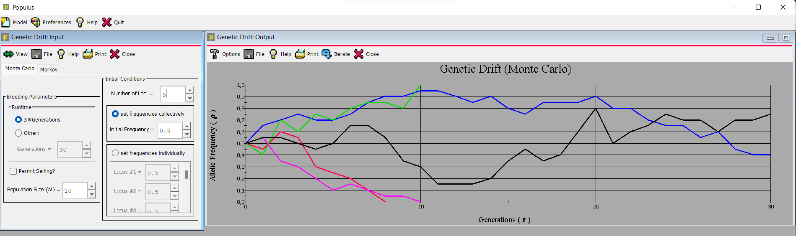
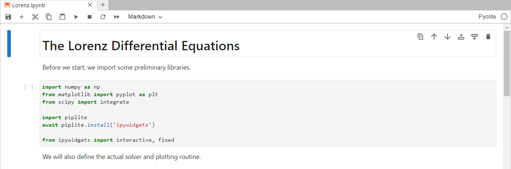
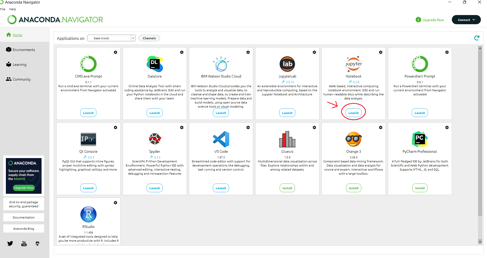
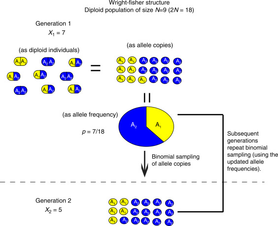
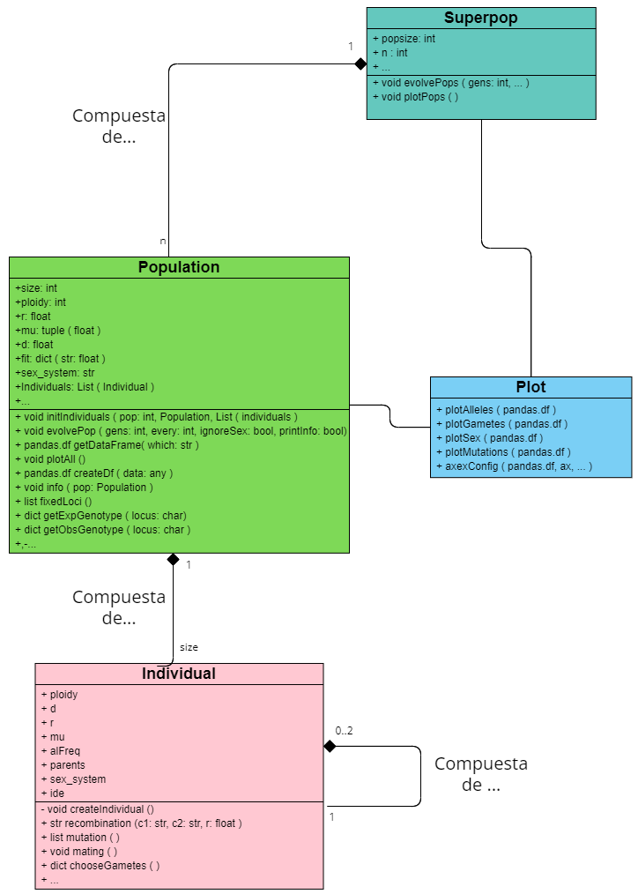
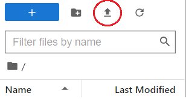
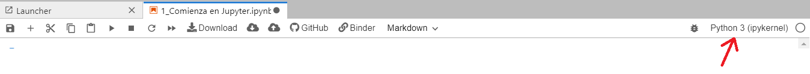

```{r setup, include=FALSE}
knitr::opts_chunk$set(echo = TRUE)
library(reticulate)
library(tinytex)
```

\begin{centering}
\vspace{3cm}
```{r uni_logo, echo=F, out.width="100%"}

```
\vspace{1cm}

\LARGE
{\bf Populy, una herramienta de simulación de procesos evolutivos orientada a la enseñanza.}

\vspace{1 cm}

\Large
{\bf Grado en Biotecnología}

\Large
{\bf Curso 2021/2022}

\vspace{1 cm}

\large
{\bf Modalidad: Trabajo de metodologías docentes}

\vspace{1cm}

\end{centering}

\large
\textbf{Autor:}

\large 
Mario Ruiz Pérez

\vspace{0.5 cm}

\large
\textbf{Tutor:}

\large
José Ignacio Lucas Lledó

\vspace{0.5 cm}
\normalsize
`r Sys.Date()`

\newpage
\renewcommand*\contentsname{Índice}
\tableofcontents
\newpage

# 1 Introducción 

Tanto la genética como la evolución son dos asignaturas fundamentales para cualquier estudiante de ciencias de la vida, estos dos campos de estudio están estrechamente relacionados, normalmente bajo el término de genética de poblaciones. Esta es una rama de la biología que aspira al estudio de la variación de las características genéticas de una población a lo largo de las generaciones [@sep-population-genetics]. Los cambios en los loci, o lugares del genoma, se suelen expresar mediante variaciones en la frecuencia de cada uno de los alelos de estudio.

Estos cambios genéticos que se producen a lo largo de las generaciones en una población son muy lentos, ya que dependen de la vida promedio de una especie. Es por esto por lo que el campo de la genética de poblaciones y la biología evolutiva en general han sido predominantemente cuantitativas, requiriendo de planteamientos teóricos, métodos numéricos y simulaciones por ordenador para su estudio [@Servedio2014].

El estudio de la biología evolutiva, tanto académico como formativo, ha ido muy parejo con los avances tecnológicos por su propia naturaleza dilatada en el tiempo. Esto no ocurre con tanta relevancia en otros campos como puede ser la genética clásica o la biología celular, donde el abordaje experimental es mucho más viable por la inmediatez de las observaciones.

Además, diversos estudios muestran que la comprensión de los fundamentos teóricos quedan mejor integrados en el alumnado cuando se asimilan de forma activa [@Drexel2009]. A modo general, implica una interacción más directa con el contenido que se estudia más allá de una lectura repetitiva. Existen diversas formas de lograr la participación de los alumnos, como por ejemplo plantear ejercicios o problemas durante una clase. Estos métodos, aunque básicos, ayudan a afianzar los conceptos enseñados proporcionando un aprendizaje activo en el alumno [@Chen2015]. 

Este aprendizaje activo, enmarcado bajo la teoría filosófica del constructivismo [@Nola2005-dj], defiende que el conocimiento no se adquiere, sino que se construye a través de la experiencia e interacción. Existen infinidad de formas distintas: plantear preguntas o incluso realizar experimentos sencillos son ejercicios que permiten al alumnado interactuar de alguna forma con la materia. A mayor nivel de interacción mejores son los resultados académicos.

Más relevante es este concepto de aprendizaje activo en la enseñanza de los conceptos de genética de poblaciones en las aulas; es posible plantear problemas pero difícilmente se puede plantear un experimento clásico en laboratorio para el estudio de los cambios genéticos en una población. Por esto se suelen utilizar programas de simulaciones y/o aproximaciones numéricas, ya que facilitan la comprensión de los fenómenos clave que tienen lugar en la evolución de las especies de forma casi instantánea, normalmente mediante la obtención de gráficos y tablas de frecuencias; varias de estas herramientas permiten simular y visualizar la evolución en un aula mediante el uso de un ordenador. No solo eso, sino que el avance en la capacidad de computación de los ordenadores personales permite obtener simulaciones más realistas, en menor tiempo y de forma más intuitiva; así como estudiar fenómenos más complejos de forma relativamente sencilla [@Carvajal-Rodriguez2008]. 

El potencial pedagógico de estas herramientas es inmenso. Por una parte permite a un alumno realizar un experimento de forma virtual; por la otra el o la estudiante puede manipular las condiciones para obtener distintos resultados en formato gráfico y compararlos. La comparación de un resultado esperado frente al resultado obtenido es muy importante ya que permite a la persona deshacerse de falsas creencias o preconcepciones erróneas de una materia. Fuerza a establecer una reflexión interna o externa, con el profesorado o con colegas, acerca de los resultados y las conclusiones. También puede promover la curiosidad casi científica de averiguar el porqué de ese resultado, todo esto mientras se aprende lo estudiado.

## 1.1 Estado del arte

Populus, desarrollado por la universidad de Minnesota, es una de estas herramientas de modelización de procesos evolutivos. Su objetivo principal es enseñar biología evolutiva en las aulas. Con este mismo fin, Populus se ha utilizado ampliamente por muchas universidades del mundo durante décadas, debido a que es un programa muy sencillo de instalar desde su web, y fácil de usar. Consiste de una única interfaz gráfica con un pequeño menú donde seleccionar el tipo de "evento" evolutivo. Una vez seleccionado, aparece una nueva ventana puedes ajustar algún parámetro del modelo. Al final se obtiene el gráfico en una ventana adyacente, tal y como muestra la figura 1.



Tanto Populus como otras herramientas similares supusieron una gran revolución a la hora de enseñar conceptos de biología ya que permitía una forma sencilla, novedosa y rápida de interactuar con la materia. Sin embargo, con el paso de los años el programa no se ha adaptado ni a las necesidades educativas de los alumnos de hoy en día ni a los avances en el campo de la programación.

Populus es un programa que ya no supone una novedad en su uso, los alumnos están acostumbrados al manejo constante de programas y aplicaciones, esto hace que estén en contacto con dispositivos digitales más que analógicos. Por ello, hoy día se encuentra una serie de carencias que dificultan el proceso de aprendizaje:

1. Falta de interactividad. Populus se vale de una interfaz gráfica que consiste en una serie de botones, con unos comandos predeterminados que permiten a la persona usuaria obtener un gráfico. Esto hace que el uso de la aplicación sea un proceso monótono y poco estimulante. A la hora de asimilar conceptos es necesario que ocurra una interacción real entre el software y la persona. Cuando el objetivo del programa es obtener un resultado, un gráfico en este caso, este tipo de interfaces pueden resultar adecuadas. Sin embargo, en el ámbito de la enseñanza, es más importante entender el proceso antes que el resultado. 

    La interactividad con un programa es un paso necesario al hablar de aprendizaje, de la misma manera que ocurre en la vida real al aprender a usar herramientas. La persona usuaria primero debe familiarizarse con esa nueva herramienta para conocer lo que puede y no puede hacer; incluso hasta cómo funciona o por qué lo hace. Una vez aprehendido, podrá utilizarla de una mejor forma, y podrá interpretar mejor lo que está ocurriendo.

2. Falta de transparencia. El uso de este tipo de interfaces oculta el proceso que ocurre tras ellos, simplificando el proceso de cara al usuario pero impidiendo conocer cuál es el procedimiento que se lleva a cabo. Si a una persona se le plantea un problema que debe resolver con este programa, simplemente accederá a la aplicación y obtendrá el gráfico que se buscaba. El o la estudiante no puede acceder de ninguna forma al proceso subyacente tras los botones, cuál es el algoritmo que se aplica para obtenerlo y, en definitiva, cuál es el mecanismo estudiado.

3. Falta de flexibilidad. La interfaz gráfica de Populus hace inviable llevar a cabo otro tipo de simulaciones que no sean las que tiene disponibles, no solo ésto sino que tampoco permite modificar otros parámetros para el modelo, ni modificar el estilo del gráfico o combinar distintos tipos de simulaciones. En definitiva, limita la experiencia de la persona usuaria.

Cuando la interactividad es mínima, lo que ocurre tras la interfaz es inaccesible y las modificaciones posibles son nulas, la curva de aprendizaje del programa se reduce y el proceso se puede llevar a cabo con éxito, pero sin comprender el propio modelo, sin explorar las limitaciones de éste e incluso perdiendo el interés en el tema estudiado. Esto resulta, en definitiva, en un aprendizaje incompleto y deficiente.

Estos tres puntos son carencias en el programa que pueden llevar a un mayor desinterés por la materia. Ya que el alumnado no puede conocer qué es lo que sucede tras los botones, no puede modificarlo de acuerdo a sus intereses, sin depender de unas opciones predefinidas y limitadas y hace que una simulación de procesos se convierta en una tarea monótona y poco gratificante. 

Este déficit en el aprendizaje es, en ocasiones, difícil de encontrar y solventar hasta que ya es tarde. Al fin y al cabo, el alumno puede haber realizado la tarea con éxito y en tan solo unos minutos, sin haber comprendido el fundamento teórico que subyace al modelo. Este problema de aprendizaje se debe al propio programa, por lo comentado anteriormente. Obtener un resultado crea una falsa ilusión de comprensión, del mismo modo que ver la imagen obtenida en un microscopio no hace que comprendas lo que has observado, ni el propio funcionamiento del microscopio.

Otro problema de Populus es su poca reproducibilidad, estrechamente ligado al concepto de transparencia. Tal y como se observa en la Figura 1, el resultado es un gráfico sobre el cual es muy complicado obtener conclusiones, estudiar los datos obtenidos, operar sobre ellos y en definitiva, entender el experimento virtual que se ha llevado a cabo. Además, al no poder conocer lo que sucede tras los botones, es complicado poder replicar el procedimiento. Para los estudiantes de ciencias, el análisis de resultados y la reproducibilidad es igual o más importante que obtener el resultado en sí mismo. Populus no permite estudiar los pasos llevados a cabo, ya que estos están ocultos bajo la interfaz, ni compartirlos de forma reproducible con otros usuarios. Ofrecer herramientas de simulación genética puede aumentar la reproducibilidad de una simulación[@Adamack2014].

A todo esto se le suma otro factor: la importancia de la programación. La programación está tomando cada vez más relevancia en la sociedad debido a la digitalización de la mayoría de procesos, también en el mundo académico donde se utilizan con mucha frecuencia diversos lenguajes de programación para llevar a cabo tareas repetitivas, tediosas, complejas o específicas de un campo como puede ser el análisis de datos biológicos. Conocer un lenguaje de programación permite analizar los problemas desde una perspectiva diferente, más analítica, incluso otra forma de pensar [@Liao1995]. 

Hace años, programar suponía un gran obstáculo añadido, ya que lo que se buscaba era enseñar una materia en concreto, y muchas personas no tenían un ordenador en sus casas. En la actualidad, los alumnos pueden desenvolverse con facilidad con los ordenadores, por lo que introducirlos en el mundo de la programación a través de programas de este estilo proporciona un doble beneficio. Por un lado, permite obtener un conocimiento que va más allá de la propia herramienta utilizada, por otro lado permite al alumnado aproximarse a un nuevo mundo como es el de la computación a través de conceptos familiares, en este caso de la biología. Populus carece de todo esto al tener una interfaz gráfica basada en botones. Ofrecer al alumnado una interacción más directa con el software no tiene por qué suponer un problema a día de hoy y puede permitir que la propia persona usuaria conozca y se interese por lo que ocurre tras el "botón" que pulsa. 

La programación no es solo un objetivo de aprendizaje, sino una herramienta en sí misma. Mediante la programación es posible aprender multitud de conceptos diferentes, como economía, química o biología. Una ventaja de la programación frente a las interfaces gráficas es que permite a la usuaria decidir qué, cuándo y cómo quiere que un programa se comporte. Esto lo hace una herramienta versátil y flexible, permitiendo modificar el comportamiento del programa en cualquier momento y planteando escenarios diferentes. Populus, por el contrario, tiene una serie de funciones predefinidas que no permiten esto.

Además, una de las ventajas de los lenguajes de programación de "scripting" es que todo el procedimiento llevado a cabo queda registrado en un archivo, el cual es posible compartir con otras personas para que puedan llevar a cabo el mismo ensayo y verificar que los resultados son acordes a lo que se obtiene. Esto viene a solventar gran parte de los problemas de reproducibilidad que tienen programas de interfaz gráfica como Populus, donde registrar el procedimiento es más complicado, ineficiente y poco estandarizado.

Más allá de Populus existen otros simuladores de evolución como simuPop [@Peng2005] o SLiM [@messer2013slim], ambos programas surgen con una finalidad muy distinta a Populus aunque vienen a solucionar algunos de sus problemas. Sin embargo, ejecutar estos programas supone una barrera de entrada alta para usuarios inexpertos debido a que su funcionamiento requiere mayores conocimientos en programación, así como instalar un intérprete/compilador, saber cómo y dónde descargar el programa, entre otros obstáculos que dificultan su uso.

La genética de poblaciones es un campo que puede aprovechar bien los avances técnicos para brindar una aprendizaje contextualizado, interdisciplinar y adecuado a las necesidades del alumnado. 

## 1.2 Objetivos {#obj}

Bajo las premisas de aprender sobre procesos evolutivos para estudiantes de ciencias biológicas y utilizar la programación como herramienta nace Populy, un paquete de código abierto desarrollado en Python de simulación de procesos evolutivos. El paquete, aunque sencillo de utilizar, requiere conceptos de programación básicos. Por eso también se han creado unos materiales adicionales que servirán como complemento al programa, permitiendo una interactividad mayor con el software, un aprendizaje dinámico de los conceptos clave de la programación y de los procesos fundamentales de la evolución de las especies.

Los objetivos de Populy son, por tanto:

- Aprender sobre los procesos fundamentales de la genética de poblaciones.
- Ofrecer un aprendizaje interactivo, evitando el uso de botones, para que la persona usuaria deba experimentar las distintas posibilidades de resolver un problema.
- Sencillez de uso. Debe tener una curva de aprendizaje sencilla pero que a su vez suponga un cierto esfuerzo intelectual.
- Introducir a los estudiantes de biología a la programación. No se pretende enseñar a programar pero sí familiarizarse con algunos de los conceptos clave.
- Flexibilidad. El programa debe permitir modificaciones y cambios con el tiempo.

Al tratarse de un programa de código abierto el software puede ser utilizado por cualquier persona. Además, debido a su implementación, Populy puede adaptarse con el tiempo a los requerimientos del alumnado y a las mejoras técnicas, mejorando su funcionalidad e incluyendo nuevos tipos de simulaciones.

Mediante este paquete la usuaria podrá invocar una o múltiples poblaciones, crear a sus individuos, hacerla evolucionar y obtener un *output* gráfico y tabular donde poder estudiar y comprender de forma más visual algunos de los mecanismos que se enseñan en las clases, como son el equilibrio mutación-selección, la eficacia biológica en una población, la recombinación, la deriva genética, entre otros; todo en menos de 10 lineas de código. 

Junto al software, se ha desarrollado algo similar a un laboratorio virtual donde se encuentran unas [Jupyter notebook](#jup). En estas libretas se encuentran una serie de explicaciones sobre el funcionamiento del entorno virtual, de la programación en Python y del funcionamiento del paquete y de sus métodos clave. Además de unos ejercicios o casos problema que podrán ser implementados o modificados en las aulas, permitiendo un aprendizaje activo de los conceptos y una libertad mayor que la brindada por programas como Populus.


# 2 Computación como herramienta educativa {#comp}
## 2.1 Alfabetización computacional 

La tecnología está cada vez más presente en una sociedad digitalizada, es innegable el impacto que estas herramientas están teniendo en la sociedad. La educación también debe adaptarse a estas nuevas tecnologías a un ritmo mayor incluso del que lo hace la sociedad [@Iskrenovic2018]. Al fin y al cabo, parte de la educación consiste en proporcionar al alumnado herramientas para que se desenvuelva correctamente en el futuro, a esto se le conoce como alfabetización digital de la población. 

Por lo tanto, las competencias informáticas deben ser vértebra del resto de contenidos y una de las nuevas tareas pendientes en la educación es el aprendizaje de la programación [@Mishra2013].

En los últimos años surge un movimiento que pretende ir más allá de la alfabetización digital, llamado *"coding literacy"*[@codingLiteracy] o alfabetización computacional, que consiste en resaltar la importancia de la programación en el sistema educativo del siglo XXI.

La integración de los contenidos digitales en las aulas resalta la importancia que tiene la computación en la sociedad actual, la alfabetización computacional por tanto no solo se refiere a saber cómo usar herramientas digitales, sino también a entender cómo se programan y a ser capaz de utilizar los lenguajes de programación.

Las diferencias entre aprender un lenguaje natural y un lenguaje de programación no son tanto cuantitativas como cualitativas. Al fin y al cabo, ambos requieren de una sintaxis y gramática definidas y sirven para comunicarse. 
No obstante, las diferencias en sus objetivos de uso sí son relevantes. Un idioma se utiliza para comunicarse en el día a día entre personas y habitualmente en situaciones cotidianas. Un lenguaje de programación, por el contrario, es una comunicación más especializada, que sólo se da entre máquinas y personas y que representa conceptos abstractos [@Robertson1995].

Esto ha llevado a que durante muchos años la programación se enseñase de forma rígida, mediante el estudio de sus materias fundamentales: variables, estructuras de datos, estructuras de control, clases y objetos. Este método de aprendizaje busca garantizar un conocimiento especializado en base a sus aspectos teóricos. Esto es similar al método de enseñanza tradicional de los idiomas, donde se empezaba estudiando sustantivos simples, verbos y se continuaba avanzando a conjugaciones, adjetivos, expresiones... en definitiva, se pretendía conocer en profundidad las estructuras y reglas que rigen el idioma.

Uno de los mayores avances en la didáctica de los idiomas fue enfocarlo a un sentido práctico, orientarlo a la comunicación efectiva, más allá de las reglas sintácticas y ortográficas. Existen distintos métodos que buscan este enfoque comunicativo, y todos ellos tienen como objetivo el uso del segundo lenguaje más allá de la teoría. Basan el enfoque en trabajos en equipo y ejercicios, o utilizando el lenguaje fuera de la propia aula [@Cummins1998], lo que coloquialmente se conoce como aprender haciendo.

El enfoque comunicativo aboga por el uso del lenguaje en contextos diferentes. Esto permite una mayor generalización y asimilación de los conceptos. En el caso de los lenguajes de programación, esto implica usarlos en otras asignaturas que no sean específicas de informática o programación. Es decir, utilizar la programación como una herramienta de aprendizaje que está, a su vez, siendo asimilada.

La programación, como herramienta de comunicación con los ordenadores, requiere de una abstracción mayor que un lenguaje natural. Esta abstracción y "forma de ver el mundo" se le ha denominado pensamiento computacional [@Wing2008; @Shute2017], siendo éste un subgrupo del denominado pensamiento analítico. La esencia de este modelo de pensamiento se centra en la abstracción y la automatización de procesos. De hecho, existe un debate público donde se le otorga al aprendizaje de la programación la misma importancia que a aprender a escribir. La capacidad de abstracción es un buen indicador de la capacidad de resolución de problemas, aunque este marco teórico esté en debate actualmente [@Bergmann1996], la programación es relevante por aspectos más allá de sus beneficios cognitivos.

La programación abre una nueva vía de comunicación al igual que un lenguaje natural ya que la capacidad de transmitir información a un ordenador permite, potencialmente, hacer cualquier cosa que le puedas pedir a un ordenador. Esto abarca desde una sencilla suma hasta el uso de programas informáticos complejos como simulaciones espaciales o tratamiento de datos. La usuaria media interactúa con las aplicaciones mediante el uso de interfaces gráficas. Estas interfaces facilitan enormemente el uso, pero restringen las posibilidades de muchos programas y servicios web, esto es, no permiten explotar el potencial. Al introducir el alumnado en la programación se le abre un nuevo campo de conocimiento donde poder utilizar programas menos "intuitivos" pero mucho más potentes, en virtualmente cualquier ámbito, incluido la biología.

No solo eso, sino que la demanda social de un conocimiento de programación está en auge. Una gran cantidad de trabajos requieren de unos conocimientos básicos de programación: estructuras y tipos de datos, bases de datos o análisis de información. Proporcionar al alumnado unas competencias mínimas puede repercutir favorablemente en su integración en el mundo laboral [@Liao1995].

Sin embargo, las herramientas basadas en la computación evolucionan a un ritmo acelerado: existen multitud de lenguajes de programación diferentes con propósitos distintos También los recursos para aprender en la web son enormes.

## 2.2 Lenguajes de programación {#leng}

Un lenguaje de programación es un un medio de comunicación con una computadora, se constituye de una serie de instrucciones (variables, funciones...) con estructura fuertemente definida que proporciona las herramientas necesarias para llevar a cabo ciertas tareas.

Existen multitud de lenguajes de programación, que se clasifican históricamente según dos criterios:

1. Nivel de abstracción: esto es, según la similitud al lenguaje empleado por los ordenadores, también conocido como lenguaje máquina. Se le denomina de alto nivel a un lenguaje con una sintaxis más abstracta, es decir, similar al lenguaje humano y menos dependiente del *hardware* de la máquina mientras que uno de bajo nivel es más similar al lenguaje máquina pero más dependiente.
Generalmente los lenguajes de alto nivel son interpretados, por lo que se pueden ejecutar línea a línea. Esto lleva a que la creación de un *script* que contenga las instrucciones (código) sea más sencilla de usar, aunque más lenta.

2. Según el paradigma: aunque la mayoría de lenguajes de programación permiten llevar a cabo las mismas tareas e implementar los mismos algoritmos no todos lo hacen de la misma manera, existen diferentes formas de estructurar el código, los paradigmas más conocidos son Orientado a Objetos, funcional y multiparadigma.
3. Según su propósito: Aquellos con una utilidad muy restringida, pensados para una tarea concreta se conocen como lenguajes de propósito específico mientras que el resto son de propósito general.

A la hora de introducir a estudiantes uno u otro lenguaje surgen diversas cuestiones: ¿se debe enseñar primero lo más complejo, para después utilizar lo sencillo? ¿cuál tiene más aplicaciones relacionadas con el campo de estudio? ¿con qué finalidad se va a utilizar en el aula?. Las respuestas son muy diversas. En muchas aulas se comienza enseñando C o C++. Ambos lenguajes son de bajo nivel, pero muy eficientes. Se suele elegir este tipo de lenguajes en carreras o profesiones que requieren un conocimiento exhaustivo de la computación y sus estructuras [@Johnson2020]. También se defienden estos lenguajes no tanto por su utilidad sino porque una vez entendido su funcionamiento es más sencillo extrapolar los conocimientos a otros lenguajes.

Sin embargo, en los últimos años está cobrando relevancia la enseñanza de lenguajes más sencillos para un usuario inexperto. Debido a su curva de aprendizaje suave, estos lenguajes permiten obtener resultados fácilmente, aumentan la versatilidad y tienen una gran comunidad detrás.

De este tipo de lenguajes existen dos que son ampliamente usados en el ámbito académico: Python y R.

Para el propósito del presente trabajo ambos eran igualmente útiles ya que son lenguajes de scripting, de alto nivel y multipropósito, tienen sintaxis similares y tipado dinámico. En definitiva, son lenguajes sencillos de aprender y fáciles de utilizar y compartir. 

La instalación es sencilla, poseen una enorme cantidad de recursos para aprender gratis de forma autodidacta y la sintaxis es intuitiva. Todo esto hace que una persona sin conocimientos de programación puede programar y entender las primeras lineas de código en menos de 15 minutos.

Para la experiencia de usuario, las diferencias son minúsculas, en todo caso R es un lenguaje muy usado en el ámbito académico, en especial para realizar análisis y tratamiento de datos. Por otra parte, Python es más utilizado en el ámbito profesional y en la industria, con múltiples enfoques, aunque destaca por sus aplicaciones en aprendizaje máquina.

Al ser ambos lenguajes de scripting, es posible crear un fichero que contenga el código utilizado. Este mismo código puede ser utilizado en cualquier otro momento por cualquier otra persona siempre que se tenga un intérprete instalado. Las ventajas de este tipo de lenguajes es que no son dependientes del hardware del dispositivo, haciendo mucho más fácil la distribución del código, su reutilización y la reproducibilidad del proceso.

No obstante, a la hora de desarrollar el paquete Populy sí se presentaron algunas diferencias:

- R no es estrictamente multipropósito. Este lenguaje fue creado por y para estadistas [@R]. Su paradigma es principalmente el funcional: creación y uso de funciones de manera similar al comportamiento de las funciones matemáticas. Python sí es multipropósito y soporta de forma adecuada la orientación a objetos, que se explicará más adelante.

- Soporte con libretas *Jupyter*, como se menciona en el capítulo de [Jupyter Notebook](#jup). Estas libretas fueron creadas para Python y, aunque a día de hoy soportan R y otros lenguajes, es mucho más común encontrarlas en Python antes que en R.

Como se puede observar, las diferencias son muy sutiles y cualquiera de ambos podría haberse empleado. La finalidad al escoger uno u otro lenguaje era emplear un medio que no fuese complejo y que permitiera introducirse en el mundo de la programación.

### 2.2.1 Python

Python es un lenguaje de programación de alto nivel multi-paradigma de propósito general, fue diseñado por Guido Van Rossum en 1991 [@VanRossum2009]. El objetivo de este lenguaje es facilitar la interpretación del código, su aprendizaje y su uso.

La facilidad aprendizaje y la gran comunidad que tiene a su alrededor son algunos de los motivos por el cual Python es el cuarto lenguaje más popular y con mayor proyección [@stackoverflow].

Populy se desarrolló en Python principalmente debido a su sencillez de uso [@Johnson2020; @Jayal2011], sin embargo la presencia de la gran comunidad colaborativa, el gran número de herramientas y mejor paradigma de orientación a objetos que R fueron un añadido al optar por este lenguaje. El paradigma de programación orientada a objetos establece que gran parte del código, si no todo, debe estar encapsulado en Objetos. Estas entidades deben tener un propósito común, es decir, cada objeto creado debe tener unas características que lo definan [@oopwikipedia2022]. La interacción entre el código debe ser una interacción entre objetos, siempre que sea posible.

Los objetos son una herramienta que permiten encapsular el código similar en bloques comunes, haciendo el programa más legible. Esto es lo que se buscaba a la hora de desarrollar Populy debido a que uno de los objetivos es crear una población que contendría unos individuos. Mediante el paradigma de la orientación a objetos se entiende que tanto población como individuo deben ser dos clases de objetos distintas, que tendrán un tipo de relación determinada que les permitirá interactuar.
  
## 2.3 Jupyter notebook {#jup}

El proyecto Jupyter es una colaboración para el desarrollo de herramientas de libre uso (open-source) para realizar análisis exploratorios y computacionales de forma interactiva. El proyecto Jupyter fue creado en 2014 a partir de Ipython, aunque actualmente soporta más de 100 lenguajes de programación diferentes [@Kluyver2016jupyter]. Dentro del ecosistema Jupyter se encuentran las Jupyter *notebooks*, libretas Jupyter de ahora en adelante. Estas libretas son un entorno web que tuvo su origen en la facilidad de realizar y compartir análisis de datos. Sin embargo, desde hace unos años esta herramienta se está empleando en las aulas con propósitos educativos de una gran variedad de formas distintas. 

La estructura externa de una libreta Jupyter es muy simple ya que consta de bloques de información, estos bloques pueden ser de texto, escrito en formato *markdown*, o bloques de código tal y como se puede observar en la figura 2. Las posibilidades que surgen de combinar estos dos elementos son varias, desde explicar de forma detallada un bloque de código, sin tener que recurrir a manuales externos o a libros, hasta la posibilidad de plantear problemas *in situ*. Por otra parte, los bloques de código no son estáticos, la persona usuaria puede modificarlos, ejecutarlos y observar los resultados reales en el momento, así como probar a cambiar ciertos parámetros del bloque o crear su propio código, todo en tiempo real y de una forma muy dinámica. Nada de esto es posible con los métodos tradicionales, ya sea en un formato word/pdf estático, donde no se puede interactuar con los resultados, o en una interfaz gráfica, como la del Populus, donde la estructura programática queda oculta a la persona.



Una libreta Jupyter es, por tanto, un documento interactivo, orientado a la computación, que permite crear una narrativa para explicar, analizar o enseñar conceptos. 

### 2.3.1 Metodologías didácticas con Jupyter

Estas libretas se pueden utilizar igual que una presentación de PowerPoint. El profesor o la profesora puede utilizar o crear una nueva libreta en la misma clase, al tiempo que se realiza una explicación más detallada de los conceptos. Y la libreta quedará accesible al alumnado para poder ejecutarla de nuevo.

Este método de uso de las libretas se conoce como se conoce como *Shift-Enter* [@jupyteredu], que es el comando utilizado para ejecutar un bloque de código. El alumnado únicamente deberá leer el texto y a continuación ejecutar el código. Esta forma de usarlo puede ser útil para introducir al alumnado este tipo de libretas, aunque no explota todo el potencial que tienen las libretas Jupyter para la enseñanza.

El método más acorde con la filosofía de las libretas Jupyter es el de poder modificar el código y probar cosas nuevas, experimentar los cambios que se producen e interpretar tus propios resultados. Esto se puede lograr de diversas formas, la manera que se ha seguido a la hora de desarrollar las libretas para Populy es la del ejemplo trabajado o *worked example* [@Sweller1985]. Este método consiste en la introducción de un concepto teórico, junto al código necesario y más básico para llevarlo a cabo de forma guiada.Tras esto, el o la estudiante deberá realizar pequeñas modificaciones al código o crear un bloque de código propio y finalmente observar el cambio en los resultados o los errores que surjan durante el proceso. Por último, cuando el concepto teórico que se explique y el código que lo lleva a cabo queden claros se procederá a realizar un ejercicio desde 0, siguiendo los pasos explicados en la libreta anterior.

Este método puede suponer un reto, en especial la parte del problema, sin embargo este desafío intelectual junto a la interactividad de las libretas fuerza a reflexionar sobre el problema o concepto teórico de forma activa. Demandar la resolución de una tarea de complejidad variable para obtener un resultado, ya sea correcto o incorrecto es una de las técnicas más eficaces para asentar un conocimiento.

### 2.3.2 Abrir un entorno Jupyter

Las libretas Jupyter son documentos en formato json. Este formato es particular y como tal requiere de herramientas específicas para su ejecución, no es posible abrir una libreta Jupyter con un procesador de textos convencional. Es por ello por lo que existen herramientas que pueden leer la información de las libretas de forma adecuada.

En local:

Para la ejecución de una libreta Jupyter en local se requiere una distribución de software "programa" que incluya Ipython. La distribución Anaconda es la más utilizada, Anaconda es una distribución de Python y R [@anaconda]. Al instalar Anaconda se instala el software necesario para utilizar las libretas Jupyter y otras funcionalidades. Tras su instalación simplemente hay que abrir Jupyter desde Anaconda, tal y como se muestra en la figura 3. Entonces, se abrirá una ventana en un navegador web y se podrá acceder al entorno Jupyter de forma sencilla.

{width=75%,height=75%}

Esta forma es recomendada para utilizarlo de forma autónoma sin depender de servidores. Su instalación no es excesivamente compleja y solo requiere llevarla a cabo una única vez.
Además, Anaconda instala también Python y R, por lo que se podrá crear y ejecutar código en cualquier editor de texto avanzado (como VSCode, Spyder o Pycharm). Los o las estudiantes más avanzadas podrán crear entornos virtuales.

En remoto:

Una de las ventajas estas libretas es que no requieren la instalación de un compilador o intérprete en local, de un editor de textos avanzado o de un IDE (Entorno de Desarrollo Integrado). Únicamente es necesario una conexión a una libreta un servidor remoto.

Esta conexión a un servidor remoto se puede hacer mediante [MyBinder](https://mybinder.org/) [@Jupyter2018]. El o la estudiante simplemente deberá abrir un enlace donde se encuentra algo similar a un laboratorio o entorno de trabajo virtual que contiene una o más libretas. Si el uso de estas libretas no va a ser frecuente el trabajo mediante *mybinder* es una buena forma de introducir a usuarias y usuarios inexpertos a la programación.

Otro recurso web muy utilizado es [Google Colab](https://colab.research.google.com/), la forma de uso es muy sencilla ya que simplemente requiere una cuenta de Google y la instalación de una extensión de navegador para crear o abrir las libretas.

Dado que el Populy está pensado para el uso interactivo en aulas, se ha creado un repositorio en *MyBinder* donde se incluyen las libretas. Se puede acceder a ellas pulsando al siguiente enlace [Populy repositorio](https://mybinder.org/v2/gh/R-mario/Populy-notebooks/HEAD):

[mybinder.org/v2/gh/R-mario/Populy-notebooks/HEAD](https://mybinder.org/v2/gh/R-mario/Populy-notebooks/HEAD)

Estas cuatro libretas también se han añadido al [Apéndice](#apen) como archivos de texto plano.

En este laboratorio virtual el estudiante puede acceder a un total de 4 libretas, situadas en el menú izquierdo de la web. El contenido de estas libretas es:

1. Comienza en Jupyter: Contiene una introducción con ejercicios simples acerca del entorno Jupyter y sus libretas. En ésta se explica como ejecutar un bloque de código, modificar las celdas, guardar una libreta o reiniciar el entorno de forma segura. Esta libreta está pensada para usuarios que accedan por primera vez a un laboratorio virtual como es Jupyter.

2. Fundamentos de Python: Contiene una breve explicación de los conceptos más básicos de la programación aplicada a Python: variables, estructuras y funciones. En cada sección se incluyen varios ejercicios y recursos adicionales en caso de que la persona usuaria desee o necesite explorar las bases de Python con mayor profundad. El objetivo de esta libreta es introducir el lenguaje de programación Python. Debido a la naturaleza y enfoque de este trabajo es imposible abarcar la enseñanza de un lenguaje de programación, sin embargo es necesario saber qué es un lenguaje de programación y las posibilidades que ofrece Python en comparación con otros lenguajes.

3. Guía de Populy: Tal y como su nombre indica, esta libreta pretende ser una guía de uso del paquete de Populy. En ella se encuentra lo necesario para saber instalar y cargar el paquete, así como las formas de utilizarlo. Al igual que en el resto de libretas, esta también incluye una serie de ejercicios breves y preguntas que la persona usuaria deberá contestar mientras lee y ejecuta la libreta. Con esta libreta se buscan tres objetivos: 1. comprender los aspectos básicos de la evolución, 2. familiarizase con Python como objetivo didáctico 3. explorar las posibilidades que ofrece un lenguaje de programación como herramienta pedagógica.

4. Problema: En esta última libreta se incluyen dos ejercicios de complejidad variable que requieren haber superado y comprendido las tres libretas anteriores. Para hacer estos ejercicios el usuario deberá: conocer el funcionamiento de Jupyter, saber crear variables y estructuras de control sencillas con Python y saber utilizar Populy como herramienta de simulación de procesos evolutivos.


# 3 Genética de poblaciones

La genética de poblaciones es definida como una rama de la genética encargada de estudiar y describir los aspectos heredables de una población a través del tiempo [@sep-population-genetics]. Este campo de estudio se vale de diversos aspectos de la biología evolutiva, en concreto de la síntesis evolutiva moderna, y de la genética cuantitativa para estudiar las diferencias genéticas de las poblaciones.

Cuando se habla de población e individuo no se hace referencia únicamente al concepto más extendido de población; puede ser cualquier grupo de individuos que comparten una serie de características capaces de generar descendencia. Bajo este paraguas existen poblaciones de animales, bacterias o incluso células de un organismo. Existen autores como Dawkins que hablan de población y selección de genes como explicación última de varios procesos evolutivos [@Dawkins1989]. De hecho, diversos tipos de simulaciones se pueden entender mejor como una población de gametos portadores de un genotipo que dan lugar a otro gameto. Pese a ser una reducción y simplificación en el caso de poblaciones como la humana, estos modelos y simulaciones tienen cabida para explicar varios fenómenos evolutivos, con aproximaciones cercanas a las observadas en poblaciones reales.

Así pues, la amplitud de este campo de estudio es tanta como el número de poblaciones diferentes que existen, aunque compartan diversos atributos entre ellas, cada población es única y tiene sus particularidades asociadas a sus propiedades internas (estructura genética y reproductiva) como externas (ambiente y época). Ésto, unido a los largos tiempos asociados al cambio evolutivo, hacen que el abordaje experimental sea costoso en la genética de poblaciones [@Servedio2014]. 

A modo de norma, una población se observa en un tiempo determinado X, en el cual se pueden medir sus propiedades e inferir otras. Dependiendo del tipo de aproximación, se puede intentar extrapolar las condiciones del tiempo X a una población a tiempo 0 o por el contrario hacer avanzar la población hasta un tiempo X+n, siendo n un número de generaciones.

Existen numerosas aproximaciones a este tipo de problemas, normalmente tratadas mediante análisis numérico. En los últimos años han cobrado popularidad las simulaciones de población porque permiten, como su nombre indica, simular todo el proceso evolutivo en una u otra dirección, obteniendo tanto el resultado final como la información del proceso [@Carvajal-Rodriguez2008].

A la primera forma de evolucionar una población (`X -> X+n`)se la conoce como *forward simulation* o simulaciones de tiempo hacia adelante [@Peng2010-ie]. En estas simulaciones la población parte de un estado X en un momento 0 y se hace avanzar en el tiempo (generaciones) hasta llegar a otro estado. Durante el proceso se aplica una serie de funciones y/o modelos que permitirán una evolución de la población. Una vez terminada, se obtiene un informe en formato gráfico o tabular donde queda constancia del proceso, del estado inicial y del estado final. Este tipo de simulaciones son más complejas computacionalmente ya que requiere crear diversos individuos durante varias generaciones; sin embargo, tanto el proceso como sus resultados son más similares a la evolución de las especies.

Existen otros métodos, como los basados en la teoría de la coalescencia [@Nordborg2000], que parten de una población final y buscan los antepasados más probables para ese estado de forma sucesiva hasta llegar al estado inicial(`X -> 0`). A estas simulaciones se las conoce como *reverse simulation* o simulaciones tiempo hacia atrás ya que su forma de funcionar es inversa. Son computacionalmente más eficientes y útiles cuando el objetivo es obtener un ancestro común para una población, sin embargo son menos realistas y menos intuitivas.

Para este trabajo se ha optado por las simulaciones de tiempo hacia adelante debido a que uno de los objetivos de Populy es permitir a los alumnos el aprendizaje de conceptos de biología evolutiva y genética de poblaciones, este tipo de simulaciones son muy sencillas de comprender porque emulan el comportamiento de una población y también son más útiles para explicar conceptos clave de la evolución.

Para comprender cómo llevar a cabo una simulación de este tipo primero es necesario conocer los aspectos fundamentales de genética de poblaciones y biología evolutiva que la definen.

## 3.1 Estructura poblacional

La definición de población está estrechamente ligado al concepto de especie. Este término es todavía más complejo de definir y acotar ya que es difícil establecer límites entre especies cercanas, por ello existen diferentes definiciones para el concepto de especie, cada uno con sus particularidades [@Masters1989]. *Grosso modo*, una población es un conjunto de individuos de la misma especie que coexisten, que comparten una serie de características y que son capaces de generar nuevos individuos viables a nivel reproductivo [@Soler2002]. 

En el caso de las simulaciones genéticas, la población está definida por una serie de atributos fundamentales:

1. Individuos: unidad fundamental de la población
2. Tamaño: número de individuos de la población
3. Ploidia: Indica número de cromosomas homólogos, generalmente diploide o haploide.
4. Genoma: puede dividirse o no en cromosomas, generalmente indicado como número de genes y número de alelos por gen.
4. Tipo de reproducción: sexual o asexual.

Solo con estas características es posible crear el modelo más simple, conocido como modelo de Wright-Fisher, este modelo asume una serie de condiciones en la población que para un solo locus son:

- Sin selección: no actúa la selección natural sobre ningún alelo estudiado
- Sin mutación: no existe mutación en los alelos estudiados
- Sin migración: los individuos no desaparecen de la población ni se introducen nuevos
- Discretización de las poblaciones: no existen edades, generaciones no solapantes.
- Emparejamiento aleatorio: no existe selección sexual, los individuos se generan a partir del muestreo aleatorio de dos individuos de la población parental.

En el caso de varios loci se debe asumir independencia estadística entre ellos, por lo que su recombinación debe ser de `0.5`.

En definitiva, el modelo de Wright-Fisher para un locus estudia la evolución de las frecuencias alélicas tras un muestreo binomial de los gametos tal y como se muestra en la siguiente imagen



Aun con este modelo simple se puede observar un cambio en las frecuencias alélicas tras el paso de las generaciones, esto se debe a la presencia de al menos una fuerza evolutiva.

## 3.2 Evolución y fuerzas evolutivas

La evolución es el proceso de cambio de las especies a lo largo de las generaciones, el estudio de la evolución se hace a nivel de la población y se suele expresar como el cambio en las frecuencias alélicas en el tiempo. La frecuencia alélica de una población es la frecuencia de cada alelo, es decir, cada variante de un gen, en una población. En una población diploide cada individuo podrá tener hasta 2 alelos diferentes en cada locus.

En el contexto de simulación de evolución el concepto es más simple; se dice que una población evoluciona cuando se suceden las diferentes generaciones. Si se hace evolucionar una población del tipo de Wright-Fisher podría esperarse que las frecuencias alélicas de la población se mantuviesen constantes.

Darwin propuso en su libro el *On the origin of species by means of natural selection, or, The preservation of favoured races in the struggle for life* [@darwin1859origin] un único modo de cambio evolutivo: selección natural. Tras los avances en genética y otros campos de la biología se desarrolló la nueva síntesis evolutiva [@Carroll2000]. En ella, la selección natural es una de las cuatro fuerzas principales que provocan el cambio evolutivo.

### 3.2.1 Mutación 

La mutación es la primera fuerza evolutiva. Consiste en la aparición espontánea o inducida de cambios en el material genético. Estos cambios pueden tener orígenes distintos, no obstante la consecuencia última es la generación de diversidad. Esto se debe a que propicia la aparición de nuevos alelos, o el cambio de un alelo a otro en la población. Esta fuerza, junto a la migración, son las únicas que permite introducir nuevos alelos en el conjunto de genes y alelos en una población, llamado **gene pool** y junto a la recombinación genética son las únicas fuentes de variabilidad genética [@Soler2002].

Al contrario que otras fuerzas esta ocurre a nivel de genes. Sin embargo, no todas las mutaciones son objeto de la selección; por lo general solo aquellas que tengan un efecto en el fenotipo y que sean transmisibles a la siguiente generación podrán ser sometidas a la selección natural.

Las mutaciones se pueden clasificar por su efecto en la población; existen mutaciones beneficiosas, perjudiciales o neutras.La inmensa mayoría de mutaciones, especialmente las de sitio único e indels tienen un efecto neutro. En el contexto evolutivo, se dirá que una mutación es beneficiosa cuando aumenta la eficacia biológica del individuo (en esa población) mientras que una perjudicial la disminuye. Por poner un ejemplo, una mutación que cause una disminución en la supervivencia de un individuo pero que aumente su índice reproductivo podría ser una mutación beneficiosa, a pesar de suponer un perjuicio al individuo.

Aunque los tipos de mutaciones son variados (SNPs, indels, cromosómicas...), para la simulación de evolución se tomará el modelo más simple de mutación: una mutación es el cambio de un alelo al otro de forma unidireccional `A -> a`. Las mutaciones son transmisibles, por lo que su punto de origen en caso de ser un individuo real ocurriría en los gametos de los padres.
Ademas, la frecuencia de mutación será independiente para cada locus.

### 3.2.2 Selección natural

Junto a la mutación, la selección natural es la fuerza evolutiva más conocida. Fue el primer mecanismo de cambio evolutivo descubierto [@darwin1859origin] y se basa en los siguientes principios:

1. Los individuos son diferentes entre ellos (variación)
2. Parte de esa variación es transmisible generacionalmente (herencia)
3. Algunos individuos sobreviven y se reproducen más que otros (éxito diferencial)
4. El éxito de supervivencia y reproducción no es aleatoria, sino debida a las diferencias entre los individuos. (Éxito diferencial debido a variaciones genéticas heredables)

Bajo estos 4 principios, el mecanismo de selección natural se comprende como la eficacia diferencial de un genotipo en una población en un ambiente determinado, también llamado evolución adaptativa. Es decir, aquellos individuos con unas características genéticas (variación) heredables mejor adaptadas a un ambiente sobrevivirán y darán más descendencia en promedio, haciendo que esas características genéticas se vean más representadas en la generación siguiente.

La selección natural debe entenderse como una fuerza que actúa sobre los genes de un individuo pero que solamente se ve reflejado en una población, más concretamente en sus frecuencias alélicas.

Además, la selección actúa sobre el fenotipo pero solo aquellos rasgos transmisibles serán sometidos a selección natural. El mecanismo principal es conocido como *fitness* o aptitud biológica, que refleja el éxito reproductivo de unos genotipos sobre otros.

Esta fuerza, por lo general, es la que provoca un mayor cambio en las frecuencias alélicas de la población. Así como la mutación permite obtener nuevos alelos, la selección actúa haciendo que se vean favorecidos o perjudicados, según el cambio que provoquen.

Por tanto, para simular el proceso de selección natural se requiere una población que cumpla los postulados mencionados anteriormente:

1. individuos variables: para conseguir esto solo es necesario que la población inicial (generación 0) tenga alelos diferentes.

2. variación heredable: la características genéticas de un individuo deben ser heredables, esta transmisión de las características genéticas viene determinada por la [Arquitectura genética](#arq).

3. Supervivencia/éxito reproductivo diferencial: es posible simular la aptitud biológica de dos formas: asignando un valor que indique el numero promedio de descendientes según su genotipo o un valor que indique su tasa de supervivencia. Para esta simulación el *fitness* de un individuo será la probabilidad de supervivencia asignada a su genotipo. Es decir, la variación genética resulta en probabiliades diferentes de sobrevivir hasta la edad reproductiva. A modo de ejemplo: aquellos individuos con un genotipo cuyo *fitness* sea `0.2` tendrán un 20% de probabilidades de supervivencia durante el desarrollo.

### 3.2.3 Migración

La migración se puede entender como el intercambio genético (*gene flow*) entre dos poblaciones. Para que tenga lugar ambas poblaciones han debido estar separadas por alguna barrera física, temporal, comportamental o reproductiva. En el momento en que esa barrera desaparece las poblaciones intercambian individuos, en particular material genético, de forma puntual o periódica. Este intercambio puede introducir nuevos alelos en la población que antes no existían o incrementar la presencia de alguno de ellos. A mayor intercambio genético, más drástico será el cambio en las frecuencias alélicas. 

Para modelar la migración de forma realista se requiere de otra población y romper el aislamiento durante el proceso de evolución. En la simulación no se encuentra implementada la migración.

### 3.2.4 Deriva genética {#der}

En ausencia de mutación, selección, migración y suponiendo un apareamiento aleatorio se hace evidente un mecanismo llamado deriva genética.

Para entender este mecanismo es necesario ver a cada generación no como una copia sino como una muestra, una porción, de la generación previa. En este sentido, la generación hija es el resultado de tomar ciertos individuos de la generación parental. Al estudiar la población parental se observarán unas frecuencias alélicas que no serán exactamente iguales a las de la población descendiente, simplemente por el efecto de hacer un muestreo aleatorio en una población finita.

Al cambiar las frecuencias alélicas ya existe un cambio evolutivo y por tanto se dice que la población ha evolucionado, aunque sea por el azar.

Una consecuencia habitual de la deriva genética es la pérdida de alelos, lo que conlleva una disminución de la variabilidad genética y una pérdida de la heterocigosidad [@Muirhead2016], esto es, de los individuos heterocigotos.

Este mecanismo está presente en todas las poblaciones, aunque el efecto es despreciable para poblaciones grandes ya que el error en el muestreo (en la selección de progenitores) será prácticamente despreciable. Sin embargo, al reducir el número de individuos en una población es posible observar sus efectos.

Para simular la deriva genética, es conveniente reducir el tamaño de la población a 10-50 individuos, eliminar el resto de fuerzas (selección y mutación) e incluir varios loci en la población para ver la pérdida de alelos que se produce. Tras las suficientes generaciones, todos los loci quedarán fijados para uno u otro alelo.

## 3.3 Equilibrio de Hardy-Weimberg

Cuando no actúa ninguna de las cuatro fuerzas mencionadas se puede alcanzar una situación de equilibrio llamado Hardy-Weinberg. En este estado se dice que, tras una generación de apareamientos aleatorios, las frecuencias alélicas de la generación parental serán iguales a las de la generación descendiente. Una población en equilibrio se trata de una población sin cambio evolutivo. Aunque esto no ocurre en poblaciones reales, simular una población en equilibrio de Hardy-Weinberg ya permite estudiar diversas características de una población y permite compararlas con otros casos donde actúe una o más fuerzas. Un modelo de Wright-Fisher con un tamaño de población infinito cumplirá las condiciones para que se de el equilibrio de Hardy-Weinberg.

Tener una población en equilibrio permite, por un lado, realizar una simulación de forma sencilla y por otro, tener una población de "referencia" con la que comparar las medidas. Asumiendo una población en equilibrio se puede realizar un test estadístico para comprobar frecuencias genotípicas esperadas-observadas y analizar si la simulación se desvía de forma significativa de lo esperado. Si la población es suficientemente grande y con apareamientos aleatorios se dirá que la población no se encuentra sometida a cambio evolutivo.

Con todo esto, es más habitual simular las poblaciones sometidas a una o más fuerzas evolutivas para estudiar sus efectos. Es posible incluir tanto una frecuencia de mutación para cada locus; unos valores de eficacia biológica, o índice de supervivencia, para cada genotipo y cambiar el tamaño de las poblaciones para observar los efectos de la deriva genética.

Estas son las características generales de la población, sin embargo existen otros parámetros que corresponden al individuo, de todos ellos el más relevante es su estructura o arquitectura genética.

## 3.4 Arquitectura genética {#arq}

En una población diploide cada individuo posee dos copias homólogas de cada cromosoma autosómico. En los cromosomas se sitúa todo el conjunto de loci del individuo. Se utiliza la notación de *loci* en lugar de *genes* porque es más correcta, ya que un locus hace referencia a un lugar del cromosoma que no tiene por qué ser un gen. Sin embargo, para los propósitos explicativos, se puede utilizar genes para mayor claridad. 

Por defecto, cada individuo tendrá un par de genes, cada uno con dos alelos posibles `A/a y B/b` agrupados en un único par de cromosomas homólogos, esto constituye el genotipo del individuo. 

Al tratarse de una población con reproducción sexual, los individuos también tendrán un sexo que podrá ser macho o hembra, la determinación del sexo viene dada por los cromosomas sexuales que podrá ser XY,ZW o X0, de forma similar a cómo se determina, simplificando, el sexo en mamíferos, aves y algunos insectos.

Así pues, un individuo está constituido por su autosoma, sus cromosomas sexuales, unos padres y un identificador único, que incluye su número de individuo y la generación a la que pertenece.

Existen otras dos características de la población que intervienen durante el proceso de creación y evolución únicamente cuando se estudian dos o más genes. Cuando se genera la generación 0, esto es, la generación inicial, puede intervenir un factor llamado desequilibrio de ligamiento. Este valor indica la probabilidad de que dos genes segreguen independientemente. Así pues un menor valor de este número indicará una menor asociación estadística de los alelos entre los dos genes.

Durante el proceso evolutivo es la frecuencia de recombinación la que representa la independencia estadística entre dos genes. En términos biológicos, este valor numérico indica la frecuencia con la que dos cromosomas homólogos intercambian su material genético durante el proceso de recombinación, que tiene lugar en la meiosis. Este factor es similar al desequilibrio de ligamiento en cuanto a su implementación, pero en este caso indica cuál es la probabilidad de que a partir de los gametos parentales se generen gametos recombinantes.

Así pues, el desequilibrio de ligamiento se utiliza para crear una población mientras que la frecuencia de recombinación se usa durante la evolución.

# 4 Populy: uso y estructura {#uso}

Populy surge con el objetivo de aproximar conceptos de evolución y la programación a alumnos de la rama de la biología debido a las deficiencias observadas en los programas utilizados como Populus, descrito en apartados anteriores. El objetivo es que los alumnos sean partícipes activos en el estudio de los procesos evolutivos mientras aprenden algunos fundamentos básicos de la programación, enfocada en Python.

## 4.1 Método de uso {#met}

El paquete está pensado para su uso junto a las libretas Jupyter, diseñadas específicamente para usuarios nuevos en este entorno virtual. Mediante estas libretas se muestran cuáles son los métodos esenciales para llevar a cabo la creación, iniciación, evolución y obtención de resultados de una población, así como algunos ejercicios para que el usuario pueda experimentar y crear diferentes poblaciones. 
Aún con ésto, Populy se puede utilizar de forma local como un paquete cualquiera, siempre y cuando Python esté correctamente instalado. A continuación, se procederá a explicar el proceso que se debe seguir para el uso correcto del paquete desde 0:

***

Lo primero es necesario instalar, ya sea en local o remoto, el paquete Populy. El proceso de instalación de paquetes en una libreta Jupyter de Python es muy sencillo, únicamente es necesario ejecutar la siguiente linea de código.
```{python, eval=FALSE}
!pip install Populy
```

En el caso de trabajar en local, si el usuario se encuentra en Windows, primero deberá instalar el compilador de Python que se encuentra en su [página oficial](https://www.python.org/downloads/). 

En el caso de dispositivos macOS o Linux, estos ya vienen por defecto con Python instalado, sin embargo su versión es la 2.0 por lo que es necesario actualizar a la versión más reciente que también se encuentra en su página web. 

Tras esto deberá abrir la ventana de comandos de windows (cmd) o powershell e instalar el paquete mediante la siguiente línea de código:
```
pip install Populy
```
Tras esto, puede abrirse el terminal y ejecutar el programa; es altamente recomendable utilizar un editor de textos avanzado como Visual Studio Code o un entorno de desarrollo como Pycharm para poder crear y ejecutar *scripts* de forma sencilla.

Una vez instalado el paquete es necesario cargarlo en memoria (entorno de ejecución) para que pueda ser accesible de forma temporal, a este proceso se le conoce como carga o importación de librerías y paquetes. En Python, simplemente es necesario ejecutar la siguiente línea:

```{python, eval=FALSE}
import Populy
```

Esta es la forma sencilla de cargar el paquete en el entorno de ejecución, sin embargo será preferible realizarlo de esta manera. Para entender la sintaxis de los *imports* se recomienda consultar el [Estructura](#est).

```{python}
from populy.population import Population
```

En definitiva, con este tipo de importación se selecciona qué archivo se va a utilizar de todo el paquete y facilita el manejo de sus objetos.

Así pues, el primer paso es la creación de una población. Este proceso también se le conoce como instanciación y se lleva a cabo con la siguiente linea de código:

```{python}
# creación de una población
poblacion = Population()
```

En este paso se ha creado una población, como se puede observar los paréntesis se encuentran vacíos. Al no pasar ninguna variable se toman los valores por defecto en la población. Para poder ver cuáles son las características propias de la población se debe ejecutar el siguiente código:
```{python}
Population.info(poblacion)
```

Si lo que se quiere es modificar alguno (o todos) sus atributos, se puede hacer pasándole un nuevo valor en el proceso de creación de la población.

```{python}
#se crean las variables que contienen el tamaño y las frecuencias iniciales
tam = 1000
frec_alel = {'A': (0.5,0.5), 'B':(0.5,0.5)}

# inicia la población
poblacion = Population(size=tam,
                      freq=frec_alel)
```

Aunque pueda parecer complejo lo que ocurre es la asignación de un nuevo valor de frecuencias alélicas a la población. En este caso, tanto el gen A como el gen B tendrán una frecuencia de 0.5 para ambos alelos en la población.

En estos momentos la población se encuentra vacía, es decir, se le han definido sus características pero no hay individuos en ella. Es por ello que es necesario llamar a un *método* del objeto población.
```{python}
poblacion.initIndividuals()
```

Este método inicia a los individuos, que tendrán las características especificadas anteriormente. En este caso, iniciará `r py$tam` individuos, la población tendrá unos valores de frecuencias alélicas próximos a los especificados.

Para ver información sobre algunos de estos individuos se puede ejecutar el siguiente código

```{python}
poblacion.printIndividuals(show=5)
```

Una vez iniciados los individuos en la población se considera que éstos son la generación número 0.

El siguiente paso es llevar a cabo la evolución de la población:

```{python}
poblacion.evolvePop(gens=100)
```

El parámetro más importante de `evolvePop` es `gens`, se trata del número de generaciones que tomará la evolución.

Tras la evolución el proceso ya queda completado. Sin embargo, la información no queda accesible. Para ello es posible obtener una tabla de valores o una representación gráfica.

Si lo que se busca es una tabla de valores, más conocido como *dataframe*, se puede recurrir al siguiente código:

```{python}
allelicF = poblacion.getDataFrame("frecuencias alelicas")
```
```{python, include=FALSE}
df = allelicF.round(decimals = 2)
```
```{r,results='asis',echo=FALSE, warning=FALSE} 
library(kableExtra)
knitr::kable(py$df,caption = "Cambio en las frecuencias alélicas a lo largo de las generaciones", align=c(rep("c",3))) %>%
  column_spec(1,width = "0.8in") %>%
  column_spec(2,width = "0.6in") %>%
  column_spec(3,width = "0.6in") %>%
  kable_styling(latex_options = "HOLD_position")
```

Como se indica dentro del paréntesis, el código devuelve una tabla donde quedan registrados todos los cambios que ha habido en las frecuencias alélicas tras el paso de las generaciones.

Si lo que se busca es obtener una representación gráfica de este proceso es necesario ejecutar el siguiente código:


```{python, fig.cap = "Representación gráfica de la variación de las frecuencias alélicas para los alelos mayores", out.height="50%", out.width="75%", fig.env='figure', fig.align = 'center'}
from populy.plot import Plot
Plot.alleles(allelicF)

```


La sintaxis es diferente porque se utiliza `Plots` del paquete Populy ([Estructura interna](#est) ) para representar gráficamente.

La población ha evolucionado ya que las frecuencias alélicas han sufrido cambios durante las generaciones, tal y como se observa en la siguiente figura.

Para este caso de uso en el que no se ha introducido al principio ningún parámetro de *fitness*,mutación ni recombinación y al no existir migración se puede decir que la fuerza evolutiva que actúa para producir el cambio ha sido la deriva genética. Tal y como se observa, aun con un tamaño de `r py$tam` individuos la influencia de este mecanismo es apreciable y similar a lo que podría observarse en una población sometida a selección natural.

*****

Este es el funcionamiento más sencillo del paquete. En el caso de que se desee, es posible introducir una o más fuerzas de cambio evolutivo como son la mutación y la selección y estudiar su efecto, o el equilibrio entre ambas.

Para una explicación más detallada e interactiva es recomendable acudir al [laboratorio virtual](https://mybinder.org/v2/gh/R-mario/Populy-notebooks/HEAD), donde se exploran las funcionalidades adicionales del programa, además de poder ejecutar el código y trabajar con éste tal y como se ha pensado su uso.

### 4.1.1 Caso práctico: la deriva genética

En el siguiente código se llevará a cabo la simulación y visualización del efecto de la deriva genética en el cambio evolutivo.

La [Deriva genetica](#der) es el proceso de cambio debido al error aleatorio del muestreo, al tratarse de una consecuencia de la reproducción aleatoria y muestreo su efecto se ve magnificado en poblaciones de tamaños reducidos, la consecuencia observable de la deriva es la fijación alélica y la pérdida de heterocigosidad promedio. 

Para este ejemplo se utilizará un módulo de Populy llamado `superpop`, este módulo permite simular de forma simultánea varias poblaciones con las mismas características, haciendo que los efectos de la deriva genética puedan ser observados con mayor claridad.

Primero, al igual que con `Population`, es necesario importar el módulo:
```{python}
from populy.superpop import Superpop
```

La instanciación ocurre de la misma manera, se le pueden pasar los mismos parámetros que a `Population`pero es necesario indicarle el número `n` de poblaciones que se simularán.
```{python,include=FALSE}
sPop_peq = Superpop(n=6,popsize=10)
```
En este caso se crean 6 poblaciones, cada una con un tamaño de 10 individuos.

Tras la instanciación, se debe ejecutar el siguiente código, que condensa las operaciones de iniciación y evolución de la población anteriormente vistas. 

```{python,include=FALSE}
#gens=numero de generaciones
sPop_peq.evolvePops(gens=50)
```

Aunque es posible obtener un *dataframe* de cambios en las frecuencias alélicas; es mucho más recomendable  representar gráficamente el resultado.

```{python, fig.show = 'hold', fig.cap = "Representación gráfica de los efectos de la deriva genética para las frecuencias alélicas de dos locus A (izq.) y B (der.) de 6 poblaciones con 10 individuos"}
sPop_peq.plotPops() 
```


Para una población de 10 individuos el efecto de la deriva es notorio, pudiéndose observar que todas las poblaciones han sufrido una fijación de sus alelos antes de la generación 50.

Cabe la pregunta de ¿qué ocurre en poblaciones de mayor tamaño? Para eso es posible llevar a cabo el proceso anterior pero cambiando el valor de `popsize`. Para compactar el código se ha realizado mediante los siguientes bloques:

En esta parte se crea una lista de 2 valores, que serán el tamaño de cada población. Posteriormente se crean y almacenan ambas poblaciones en una lista.

```{python, include=FALSE}
sizes = [100,1000]

pops = [Superpop(n=6,popsize=tam) for tam in sizes]
```

Tras esto se lleva a cabo, para cada población en `Pops` el proceso de iniciación y evolución.

```{python,include=FALSE}
for x in pops:
  x.evolvePops(gens=100)
```

Por último se representan en dos gráficos independientes los valores obtenidos de frecuencias alélicas para cada locus.

```{python, fig.cap=c("Efecto de la deriva genética para dos locus A y B de 6 poblaciones de tamaño 100","Efecto de la deriva genética para dos locus A y B de 6 poblaciones de tamaño 1000")}
for x in pops:
  x.plotPops()
```


Figure 7: Efecto de la deriva genética para dos locus A y B de 6 poblaciones de tamaño 100 (arriba) y 1000 (abajo)

Se puede observar el efecto esperado: a mayor tamaño de población menor es el efecto de la deriva genética y menor es la desviación con respecto al valor esperado en ausencia de otra fuerza evolutiva, es decir, la población se acerca más al equilibrio de Hardy-Weinberg.

En el [Apéndice](#apen) se muestra otro ejemplo de mayor complejidad que incluye mutación, selección en más de dos alelos.

## 4.2 Estructura interna {#est}

Al comienzo se definieron los objetivos específicos del paquete, que son:

1. Obtener un software funcional.
2. Que un usuario sin conocimientos programación pueda comprender qué está sucediendo.
3. Obtener unos resultados, preferiblemente en formato gráfico, que permitan visualizar el fenómeno estudiado.

Más tarde, se comenzó con el desarrollo del software, en esta etapa es necesario establecer un esquema o sistema general. Se pueden establecer tres entidades esenciales a la hora de desarrollar este tipo de simulaciones: la población, el individuo y el genoma/cromosoma. Desde un principio quedó claro que el usuario debía poder interactuar de forma sencilla con la población, ya que es el objeto de estudio, los objetos individuos y genoma serian características las cuales el usuario no debía utilizar directamente pero debían quedar accesibles a través de la población.

Con la ventaja de ser un lenguaje multiparadigma, Python permite definir una estructura de programación muy flexible y poco restrictiva. Se optó por el paradigma orientado a objetos (OOP) debido a la idoneidad de modelar una población creando una plantilla para la creación de objetos con unas características y funciones determinadas. A estas plantillas, en el paradigma de orientación a objetos se les conoce como Clases, cada clase representa una entidad, objeto o concepto determinado. Cada clase está compuesta por unas características y unos comportamientos que la definen. A las características se les conoce como atributos y a los comportamientos como métodos (o funciones de clase/instancia), ver [Lenguajes de programación](#leng). 

En el caso de Populy debían existir, como mínimo, dos clases diferentes: la población y el individuo. A partir de este modelo de clases un usuario debía poder crear un nuevo objeto que pertenezca a una de estas clases, esto es, una población determinada. El proceso de crear un nuevo objeto se le conoce como instanciación. Tras crear el objeto y pasarle los valores que debe tener esa población el usuario debería llamar a los métodos correspondientes para llevar a cabo el proceso de evolución, entre otros.

Tras establecer la estructura se comenzó su creación. Para ello fueron esenciales dos herramientas: un editor de texto, para escribir el código, y un control de versiones para registrar los cambios.

Se empleó Visual Studio Code como un editor de textos avanzado, una de las ventajas de este editor es que permite ejecutar código un gran cantidad de lenguajes, incluido Python, así como leer y modificar libretas Jupyter (archivos `.ipynb`). Dado que el paquete está especialmente pensado para ser utilizado en este tipo de libretas era conveniente tener una forma rápida y accesible de editar estos archivos.

El sistema de control de versiones empleado fue git y github. Este software permite llevar un registro de todos los cambios realizados en el programa de forma profesional, crear ramas sobre las que tener registros diferentes, recuperar versiones anteriores, entre otros. Github, por otro lado, permite la integración web del programa desarrollado y sus versiones, su funcionamiento consiste en un repositorio online en la página web donde se encuentra tanto los archivos del programa, sus ramas y el historial de versiones. Con estas herramientas (git+github) es posible acceder y descargar el software de forma gratuita. También permite realizar proyectos colaborativos, donde cada usuario contribuye con una parte del proyecto, proponer cambios a una versión y sincronizarlos con otro usuario.

Para el desarrollo de Populy se empleo como un control de versiones simple, donde cada actualización del trabajo queda registrada como una nueva versión, posteriormente estos cambios se actualizan en el repositorio web de [https://github.com/R-mario/populy](https://github.com/R-mario/populy), donde quedan visibles y se pueden consultar.

Cuando se desarrolla un software es habitual estructurar las distintas funcionalidades en archivos distintos. A esta estructuración se le conoce como 'paquete' o 'librería'. Un paquete está compuesto de módulos, a su vez, un módulo contendrá la funcionalidades similares agrupadas. En el caso de Populy cada módulo consiste de de una clase en particular y tiene extensión `.py`.

Así pues, el desarrollo comienza creando 2 módulos dentro del paquete Populy, llamado `population` e `individual`, estos módulos contienen las clases Population e Individual, respectivamente.

La clase `population` debía tener los atributos generales de la población (tamaño, ploidía, frecuencias alélicas iniciales,...) y métodos que permitieran llevar a cabo los diferentes procedimientos para iniciar, evolucionar y obtener información de ella.

La clase `individual` debía tener atributos particulares de cada individuo (cromosomas,sexo,padres,..) y también generales, de la población a la cual pertenecen, así como métodos que permitan crear ese individuo desde 0 o a partir de unos padres.

Más tarde se incluyeron dos nuevos módulos, el primero contendría la clase Superpop, que agrupa la funcionalidad de `population` para llevar a cabo simulaciones de varias poblaciones al mismo tiempo.

El otro módulo, llamado `plot`, haría posible la representación gráfica de las características de la población.

El resultado queda reflejado en el siguiente diagrama de clases de la figura 7, donde se puede observar los atributos y métodos más relevantes de cada clase.





Tal y como se observa en el diagrama, las clases se relacionan entre ellas mediante de diferentes formas. La clase `Superpop` está compuesta de objetos de la clase `Population`, que a su vez está compuesta de objetos de la clase individual. La composición refleja que un objeto contienen uno o más objetos de la otra clase. Esto es similar a una población normal, que está compuesta de individuos. 

Debe distinguirse dos peculiaridades, la primera es que la clase `Superpop` no es un conjunto de poblaciones que interaccionan, se trata de una clase que permite agrupar la creación de multitud de poblaciones similares pero sin intercambiar individuos entre ellas. La segunda se trata de una relación entre los propios individuos, esto se debe a que un individuo tiene unos progenitores, que son a su vez individuos.

Tanto `Superpop` como `Population` implementan la clase `Plot`, esto significa que tienen acceso a los métodos de ésta clase, que son los que permiten representar la población.

Todas las clases requieren también de paquetes adicionales. Las dos más importantes son pandas, un paquete orientado al análisis de datos que permite obtener y modificar tablas de forma rápida, flexible y potente y matplotlib, una librería para obtener gráficos de todo tipo. Además de otros paquetes que se han utilizado de forma puntual como numpy, random o scipy.

Además de estos módulos, el paquete también contiene otros archivos necesarios para construir y documentar el paquete como la licencia, el README o los archivos de configuración. Junto a éstos se encuentran unos tests unitarios, que sirven para hacer comprobaciones automáticas de varios casos posibles y casos límites a la hora de utilizar el paquete. Esto es ha sido útil durante el desarrollo para encontrar errores y comprobar cambios que se realicen.

Tras finalizar una versión el paquete se subió a PyPi[@pypi], el repositorio de paquetes de Python, para que pudiese ser instalado en cualquier ordenador con Python mediante el comando `pip`.

Para finalizar el trabajo se creó el laboratorio virtual utilizando *mybinder*. Este laboratorio contiene 3 libretas Jupyter que pretenden introducir al alumnado a los conceptos esenciales del trabajo, que son: el entorno Jupyter, la programación en Python y el paquete Populy. Junto a un ejercicio que requiere la integración de los conocimientos adquiridos, especialmente en lo que respecta al uso de Populy. Para conocer más sobre el entorno Jupyter y las libretas creadas puede consultarlo en la sección de [Jupyter notebook](#jup).

Por último, el formato de redacción de este trabajo ha sido posible mediante r-markdown, un formato de archivos para hacer documentos dinámicos e integrar código junto a texto de forma orgánica. Aunque internamente sea diferente a las libretas Jupyter, los archivos r-markdown también permiten escribir texto en formato markdown y bloques de código ejecutables, junto a la capacidad de construir archivos pdf o html estilizados.

Puede consultarse todo el código y sus versiones en el siguiente [Repositorio de Populy](https://github.com/R-mario/populy).

## 4.3 Perspectiva y limitaciones

Populy es un paquete de simulación de procesos evolutivos desarrollado en Python con propósitos educativos. Uno de los [objetivos](#obj) de éste era crear un software acceso libre para que cualquier persona pueda utilizarlo. No solo esto, la idea es que el mismo paquete pueda sufrir modificaciones para incluir mejoras en el rendimiento, estructurales y nuevas simulaciones más avanzadas. 

En estos momentos Populy tiene limitaciones en el rendimiento al simular grandes poblaciones con varios loci, sería interesante poder revisar la implementación en el código fuente en este aspecto para mejorar su tiempo de simulación. 

Actualmente el genoma se encuentra codificado como una tabla hash o diccionario de pares clave-valor, donde la clave es el locus y el valor el alelo para ese locus. Esta forma, aunque sencilla y eficaz para pocos loci, se convierte en una opción limitada al aumentar el número de genes. Existen alternativas como almacenar los cromosomas en un array de bits, mediante este método más compacto sería posible simular loci enteros según su secuencia genética, haciendo el modelo mucho más realista y permitiendo simulaciones más avanzadas, también haría posible simular más de dos alelos, así como mutaciones de un solo nucleótido e incluso delecciones e inserciones.

Otro obstáculo es el número de autosomas, en la actualidad Populy solamente soporta un único cromosoma. Aunque para simulaciones de pocos genes puede ser adecuado también le resta realismo a la simulación.

En cuanto a modelos, actualmente Populy cuenta con los necesarios para el aprendizaje de los procesos evolutivos más relevante: mutación, recombinación, selección, deriva genética, entre otros. Sin embargo sería necesario incluir la posibilidad de introducir nuevos genes en la población mediante la migración, una estructura de edades para obtener una selección dependiente de la edad o un tamaño de población variable, con posibilidad de añadir parámetros de crecimientos dependientes de la densidad de población.

# 5 Conclusiones

Es una realidad que las herramientas tecnológicas están cambiando la forma que los alumnos aprenden, no solo en forma sino también en contenidos. La importancia de los ordenadores en las aulas no ha hecho más que crecer y con ello deben hacerlo las nuevas herramientas educativas.

Es esencial proporcionar al alumnado aquellas herramientas que permitan comprender mejor los contenidos de la asignatura y que se adapten a los cambios tecnológicos. En ocasiones estos cambios son complejos pero no por ello se debe dejar de explorar las posibilidades que ofrecen los nuevos medios tecnológicos de enseñanza.

Populy ha sido construido mediante la programación, a partir de los conceptos de la evolución y la genética de poblaciones pero siempre orientada a la enseñanza dinámica e interactiva. Como tal, Populy y sus libretas Jupyter reivindican que algunos de los métodos más tradicionales de enseñanza como son el uso de programas del estilo de Populus ya no tienen sentido en las aulas; Populy pretende ser una herramienta actualizada y adaptada a las nuevas necesidades y avances técnicos para modelar procesos simples.

Para concluir, el trabajo está orientado para estudiantes en los primeros cursos de las ciencias biológicas y ciencias de la vida. Aunque tanto Populy como el laboratorio virtual Jupyter puede ser utilizado por cualquiera, son éstos los estudiantes que más pueden valerse de la herramienta por varios motivos. 

En primer lugar porque la evolución es una pieza fundamental en estas enseñanzas y como tal requiere ser abordada en las aulas desde múltiples perspectivas, ya sea teóricas, experimentales y/o computacionales.

En segundo lugar porque explora las nuevas herramientas de computación interactiva como son el entorno Jupyter, proporcionando una forma de trabajo más estimulante para el alumnado, donde puede crear, ejecutar y comprobar sus propios resultados.

Y por último, pretende introducir conceptos sencillos de programación a estudiantes con pocas o nulas nociones, una habilidad muy demandada y útil, en especial con los avances que tienen lugar en la biocomputación.

# Referencias

<div id="refs"></div>
\newpage
# Apéndice {#apen}

\addtocontents{toc}{\protect\setcounter{tocdepth}{0}}

## Ejercicio extra

Se incluye otro ejemplo más avanzado del paquete Populy, donde se combina mutación, selección y se utilizan otros métodos no vistos en el apartado [Método de uso](#met).

Población de tamaño 500, diploide, con tres locus (A,B,C) y dos alelos por locus. El alelo mayor domina sobre el otro en la población inicial con una frecuencia de 0.9 vs 0.1 para los tres loci.

El locus A tiene una frecuencia de mutación 10 veces menor a B y C. La mutación es unidireccional.

```{python}
poblacion2 = Population(size=500,
                        freq={'A':(0.9,0.1),'B':(0.9,0.1),'C':(0.9,0.1)},
                        mu=(0.001,0.01,0.01))

poblacion2.initIndividuals()
```

Se evoluciona la población 100 generaciones.

```{python}
poblacion2.evolvePop(gens=100)
```

Se obtiene el cambio en las frecuencias alélicas. Se espera una disminución del alelo mayor (representado en el gráfico) debido a la presencia de mutaciones.

```{python, fig.cap="Variación de las frecuencias alélicas en la poblacion"}
alle = poblacion2.getDataFrame("frecuencias alelicas")
Plot.alleles(alle)
```

Se obtiene su representación en formato de tabla y gráfico del cambio del número de mutaciones por generación. Se espera una reducción en el número total conforme se reduce la frecuencia del alelo mayor para cada locus.

```{python, fig.cap="Número de mutaciones en cada locus por generación"}
mut =poblacion2.getDataFrame("mutaciones")
Plot.mutations(mut)
```

La población avanza 100 generaciones más, esta vez añadiendo un nuevo parámetro `fit` que actuará sobre aquellos individuos cuyo genotipo posea el alelo mayor A. 

Para este locus, el alelo mayor A actuaría como dominante y la selección actuaría contra este, ya que la eficacia biológica se vería reducida tanto en homocigotos como heterocigotos por igual.

```{python}
poblacion2.evolvePop(gens=100,fit={'A':0.1})	
```

Se obtiene una representación de las frecuencias alélicas, gaméticas, de sexo y número de mutaciones para la población.
Se espera observar una reducción abrupta en el alelo mayor A así como una reducción paulatina en la frecuencia de todos los alelos mayores debido a la mutación unidireccional, también un aumento paulatino en frecuencia del gameto 'ABC'.

```{python, fig.show="hold",fig.cap="Se muestran cuatro tablas que representan, de izquierda a derecha y de arriba a abajo la variación en las frecuencias alélicas, variación en las frecuencias gaméticas, variación en la frecuencia de los sexos y número de mutaciones por generación"}
poblacion2.plotAll()
```

Por último, es posible estudiar la desviación de los genotipos observados frente a los esperados para cada locus según el modelo de Hardy-Weinberg mediante los siguientes dos métodos.

```{python}

obs = poblacion2.getObsGenotype('B')

exp = poblacion2.getExpGenotype('B',what_pop='initial')
roundexp = {k:round(v,2) for k,v in exp.items()}

print(obs,roundexp,sep="\n")

```

Tal y como era esperado el número de genotipos observados no coinciden con las esperados. A partir de los resultados obtenidos se puede realizar el test chi-cuadrado para rechazar la hipótesis nula.

*****

## Libreta 1: Comienza en Jupyter

Bienvenido al entorno de programación interactiva llamado Jupyter. 

Si has abierto esto, significa que has abierto un archivo llamado *Jupyter Notebook*. Estos cuadernos son una herramienta de programación interactiva. Están formados por texto y código intercalado. Estos párrafos son una celda de texto.

Las céldas de código se muestran en un recuadro de fondo gris. La celda de abajo es bloque de código que contiene una sencilla instrucción.


```python
print("Hola mundo!")
```

Las celdas de código son ejecutables, es decir, es posible llevar a cabo la instrucción.

Para ejecutarla es necesario situarse sobre ella (deberá aparecer una línea azul a su izquierda), después debes hacer una de estas dos opciones:

1. Buscar en la barra de herramientas el símbolo de play que aparece en la imagen.

2. Pulsar `ctr+Enter` o `shift+Enter` en windows. En macOS pulsar `cmd+Enter`.


Prueba a ejecutarla para ver el resultado.

Si todo ha funcionado correctamente habrá aparecido el texto "Hola mundo!" bajo el bloque de código. Eso es el output de la consola.

En el caso de que no funcione es posible que tengas que reiniciar el kernel.

**Nota**: ves a *settings*>*Theme*>*Jupyterlab dark* para cambiar a modo oscuro si quieres.


Una de las ventajas de estas libretas es que puedes explicar y ejecutar código al mismo tiempo. Los bloques de código no son independientes por lo que si se crea una variable en uno de ellos es posible acceder a ésta en otro bloque cualquiera.

Primero vamos a crear una nueva variable llamada `numero`.


```python
# esto es un comentario dentro del codigo
numero = 1234
```

## Crear bloques de código

Además de los bloques de código y texto que estás viendo, es posible crear nuevos. La forma de hacerlo es pulsando sobre el botón más ( + ) en la barra de navegación. Los bloques se crearán inmediatamente después del bloque seleccionado. 

Prueba a crear un bloque de código justo abajo y muestra por pantalla ( usando `print` ) el valor que contiene la variable `numero`


```python
## Modificar tipo de celda

Para cambiar de código a texto y viceversa debes seleccionar la celda que
desees cambiar y pulsar el último botón de la derecha de la barra de navegación.
En este ejemplo debe poner **Code**. Seleccionalo y cambia a **Markdown**, que son
las celdas de texto.

Cambia esta celda a una de tipo **Markdown**
```

## Guardar y cargar una libreta
Para guardar los cambios en la libreta pulsa al botón de guardar, esto permite que si recargas la página no se pierdan los cambios.

Aun así estas libretas Jupyter se ejecutan en remoto, es decir, están alojada en un servidor externo. Esto es lo que permite que puedas acceder mediante un enlace; sin embargo, una vez cierres la página se cerrará la libreta y se perderán los cambios.

Para evitar esto puedes descargar la libreta mediante el botón *Download*. Esto descargará un archivo con extensión `.ipynb`.

Para volver a cargar la libreta debes pulsar en el botón de subida de archivos que se encuentra en la esquina superior izquierda, en la barra de navegación de la lista de archivos. 



<a id=’kernel’></a>
## Kernel
El kernel es el núcleo y es lo que permite a Jupyter interpretar que el código escrito pertenece a un lenguaje determinado, en este caso Python.

Existen dos motivos principales por los que el kernel no funciona:

1. Desconexión
El kernel se desconecta cuando pasan varios minutos sin ejecutarse ningún bloque de código, es decir, cuando la libreta está inactiva.

Para saber si el kernel está apagado podemos fijarnos en la esquina superior derecha, donde se encuentra un círculo. Si todo está correcto debería aparecer algo así como `Python 3` al lado de éste.

En caso de que esté desconectado aparecerá `No kernel`, para **solucionarlo** debemos pulsar sobre ésto y seleccionar el kernel de Python.



2. En ejecución
Es posible que se haya ejecutado un bloque de código que requiere de mucho tiempo de procesamiento, en estos casos el kernel estará ocupado con ese bloque y no permitirá la ejecución del resto. La

Para saber si el kernel está en uso podemos fijarnos también en la esquina superior derecha, si está ocupado donde antes el círculo era blanco ahora será negro.

Para encontrar el bloque de código en ejecución podemos fijarnos en los paréntesis a la izquierda del bloque. Si hay un asterisco en ellos \[*\] en lugar de un número significa que está procesando la información.

Para **solucionarlo** debemos pulsar al botón de *stop* que se encuentra al lado del de *start* en la barra de navegación. 

En caso de que no funcione ninguna de estas dos opciones prueba a reiniciar el kernel dandole al botón al lado del *stop*, el primero reinicia el kernel y el segundo reinicia y ejecuta todas las celdas. 


Recuerda que esta opcion elimina todas las variables en memoria, por lo que deberás volver a ejecutar los bloques anteriores.

El siguiente código es un bucle, prueba a ejecutarlo a ver qué sucede.


```python
while True:
    i = 0
```

Parece que el bloque no para de ejecutarse, fuerza la interrupción con lo visto hasta ahora.

Si todo ha ido correctamente habrán sucedido dos cosas:

1. habrá saltado una excepción (texto en rojo) bajo el código, indicando que ha habido un problema durante la ejecución. Esto es normal ya que hemos **interrumpido** el proceso.
2. El círculo de la derecha estará blanco otra vez, indicando que el kernel está disponible.

Muy bien, ya conoces el funcionamiento de las *Jupyter notebooks*, ahora prueba a abrir el siguiente archivo **Aprendiendo Python**.


******

## Libreta 2: Aprendiendo Python

### Fundamentos esenciales de programación a través de python
El objetivo de este notebook es hacer una breve introducción a las estructuras esenciales en Python, orientado al uso de Populy. 

Python es un lenguaje de programación sencillo de utilizar y aprender. 
Este cuaderno tiene como objetivo hacer una rápdia introducción a Python, para aprender con más detalle los fundamentos recomiendo especialmente [W3Schools](https://www.w3schools.com/python/python_intro.asp) y siempre acudir a la [documentación](https://docs.python.org/3/tutorial/index.html) cuando surja alguna duda.

### Tipos de datos


```python
entero = 2 # esto es un comentario
decimal = 3.14 # los comentarios no se ejecutan
frase = "esto es una cadena de caracteres" # sirven para dar contexto
verdad = True
```

Eso de arriba son variables, las variables guardan información sobre algo. ¿Sencillo, no? Para definir cualquier variable siempre se sigue esta estructura de "nombre_de_la_variable = valor''.

El valor puede ser multitud de cosas, en este caso son un numero entero (`int`, de *integer*), un numero decimal (`float`, de *floating point*), un texto (`string`) y un valor dicotomico Verdadero/Falso (`bool`, de *boolean*). A esto se le conoce como tipos de datos o estructura de datos. 

En otros lenguajes de programación es necesario definir qué tipo de dato va a almacenar la variable. En nuestro ejemplo seria `int entero = 2` ya que almacena valores enteros. Por suerte Python interpreta el tipo de dato de forma automática.

#### Ejercicio 1
Crea una nueva variable (dale el nombre que quieras. Ej: `numero`) que sume los valores de las variables `entero` y `decimal` creadas previamente. **Nota 1**: para poder sumar las variables primero es necesario que se carguen en la memoria, por lo que primero deberás haber ejecutado el bloque de código que las contiene.

 ¿De qué tipo es la nueva variable? Investiga cómo conocer el tipo de una variable cualquiera. **Nota 2**: debe sumarse los valores almacenados en las variables, esos números podrían ser otros diferentes 2 y 3.14. 

**Extra**: ¿existe alguna forma de convertir un valor decimal a entero? 


```python

```

#### Ejercicio 2
- ¿Qué intentaba hacer este pobre inepto en el bloque de abajo?
- ¿Cómo se puede solucionar el error?

Pista: Los errores son tremendamente útiles (y comunes) a la hora de programar, utiliza la información que te proporcionan para saber qué puede estar sucediendo.

Pista 2: Utiliza google, está todo ahí.

**Nota**: `print` permite enseñar en la consola el contenido de una variable.


```python
# Prueba a sumar
frase = frase + entero
print(frase)
```


    ---------------------------------------------------------------------------

    TypeError                                 Traceback (most recent call last)

    <ipython-input-2-c7a7006e9bf4> in <module>
          1 # Prueba a sumar
    ----> 2 frase = frase + entero
          3 print(frase)
    

    TypeError: can only concatenate str (not "int") to str


Además de los tipos de datos simples existen otro tipo de datos que permiten almacenar conjuntos de datos. Es decir, un tipo de dato entero `int` solamente almacena un valor numérico. Con estas estructuras podemos almacenar varios de estos valores en una sola variable. A este tipo de datos almacenan colecciones de otros tipos de datos.

Los más comunes son:


```python
# Lista
numeros = [1,2,3]
# tupla
letras = ("a","b","c")
# diccionario
abecedario = {"a":1,"b":2,"c":3}
# set
identificadores = {'1a','2b','3c'}
```

- Una lista, como su nombre indica, contiene una lista de valores (generalmente del mismo tipo aunque no es necesario). Esta lista se puede modificar.
- Una tupla es igual a una lista aunque **no** es modificable; una vez creada la variable contendrá siempre los mismos valores. A no ser que la reescribamos.
- Un diccionario consiste en pares clave:valor (**key:value**). Permiten asociar dos datos distintos. En este ejemplo asocian una letra con un número.
- Un set es una tupla que no puede contener valores repetidos.

Cuando una variable está formada por sub-elementos es posible acceder a cada uno de ellos por su posición. La primera posición en la mayoría de lenguajes, incluido Python, es el 0. Así pues el primer elemento en la tupla `letras` se accede de la siguiente forma:


```python
letra_a = letras[0]
print(letra_a)
```

#### Ejercicio 3

¿Muestra el primer elemento de la lista `numeros`, el segundo elemento del set `identificadores` y el tercer elemento del diccionario `abecedario`. ¿Funciona correctamente?

**Pista1**: existen tipos de datos no ordenados, por lo no es posible acceder mediante su posición.

**Pista 2**: recuerda que es posible convertir unos tipos de datos a otros.


```python
# escribe aquí tu código
```

#### Ejercicio 4
¿Pueden los valores de un diccionario (*values*) ser tuplas en lugar de un único numero? ¿Y las claves (*keys*)? 

Crea un diccionario que almacene 3 puntos (P1,P2,P3) en un eje de coordenadas tridimensional (X,Y,Z).


```python
# escribe aquí tu código
```

**Recuerda**
- Los caracteres `char` y cadenas `string` siempre van acompañados de comillas simples `'hola'` o dobles `"hola"`.
- Los diccionarios se definen con llaves { } y cada par clave-valor se separa por comas ( , ).
- La lista se define con corchetes [ ] mientras que las tuplas lo hacen con paréntesis ( ).

## Estructuras de control: if & else

Un condicional es un tipo de estructura que permite ejecutar un codigo según si se cumple o no una condición. Ejemplo:


```python
if 8 > 5: # si se cumple...
    print("La condición se cumple")
else: # si no se cumple...el else es opcional
    print("La condición no se cumple")
```

La condición se introduce justo después de la palabra `if`, en este caso se evalúa si el 8 es **mayor que** 5. El resultado de esta comparación es un tipo booleano, esto es, un verdadero o falso. Si el resultado es verdadero se ejecutará lo que se encuentra dentro de el if, si es falso se ejecutará lo que se encuentra en el `else`. Como en este caso es veradero se enseña por pantalla.

La condición `else` es opcional, es decir, puedes comprobar solamente si se cumple una condición. También es posible concatenar varios condicionales mediante la sintaxis [`elif`](https://www.w3schools.com/python/python_conditions.asp).

Los operadores lógicos son los de toda la vida, aunque hay que respetar el orden y la sintaxis de los signos:

- `>` mayor que
- `<` menor que
- `==` igual a
- `>=` mayor o igual a
- `<=` menor o igual a
- `!=` diferente a

Atentos: El *igual a* se escribe como *"=="* para diferenciarlo de la asignación "=".
```Python
#asignación
variable = 8
#comparación
variable == 8
```

**Recuerda**: tras la condición en el if van los dos puntos **:** , seguidos de una tabulación que indica la pertenencia a esa condición. Todo el codigo tabulado inmediatamente posterior se ejecutará **solamente** si se cumple la condición.

#### Ejercicio 5

Crea otro condicional que compruebe si la `var1` es mayor o igual a la `var2`, si lo es que printe la informacion de `var1`.

**Nota**: recuerda seguir la estructura vista en el código anterior, no te olvides de tabular el código dentro de las condiciones:
```
if condicion:
    código
else:
    otro código
```


```python
var1 = 1
var2 = 1.0
# escribe aquí el codigo
```

### Estructuras de control: for & while
Los bucles son estructuras que permiten ejecutar el código de su interior varias veces, básicamente permite repetir una acción sin tener que escribirlo mismo muchas veces.

El siguiente bloque de código recorre la lista que hemos creado y enseña por pantalla los números que contiene.

La forma de leer esta sentencia es "desde...hasta".


```python
numeros = [1,2,3,5,8]
for i in numeros:
    print(i)
```

Este tipo de bucles en otros lenguajes de programación se les conoce como *for each* ya que lo que hacen es recorrer una variable para cada sub-elemento de esa variable. En nuestro ejemplo la variable números contiene 5 números, por lo que el bucle se repetirá 5 veces (0 a 4).

¿Qué es esa `i`? Es una variable temporal o variable local, que se crea solamente para el bucle y desaparece cuando termina de ejecutarse. Así pues, `i` va tomando los valores que se encuentran en cada posición de `numeros`. i = 1, i = 2,..., i = 8.


Conociendo el funcionamiento del bucle for, ¿sabrías decir qué hace este bloque? Prueba a ejecutarlo.


```python
i = 0
while i < 8:
    i += 1
    print(i)
```

¿Qué diferencia a la variable `i` en este bloque en comparación a la variable `i` del bloque anterior?

Tanto el for como el while se pueden usar indistintamente en la mayoría de ocasiones. Sin embargo el `for` es mucho más comun para recorrer elementos mientras que el `while` (mientras que...) se utiliza para llevar acabo acciones hasta que se cumpla una condición.

#### Ejercicio 6
Haz un bucle que sume los valores de la lista siguiente y los guarde en una nueva variable:


```python
lista2 = [1,2,3,4]

# aqui abajo va el bucle
```

#### Ejercicio 7
¿Es posible recorrer un diccionario y mostrar tanto su clave como su valor? Intenta recorrer el diccionario creado anteriormente `abecedario`. 

**Nota** Recuerda que está formado por un par clave:valor.


```python
diccionario = {'a':1,'b':2,'c':3}
```

### Funciones

Una función es un bloque de código autocontenido que cumple una... función, un propósito. En un principio puede parecer que todas las celdas de código ya cumplen una función. Es cierto, sin embargo lo bueno y útil de las funciones es que las puedes utiliar cuando quieras una vez creadas.

Se podría decir que una función es una variable extendida, así como una variable contiene un valor (o conjunto de valores) una función contiene una serie de pasos, un algoritmo.

Las funciones aceptan una entrada de datos (variables) y pueden devolver (o no) un resultado, de forma similar a una función matemática.

$f(x,y) = x+y$

Donde $x$ e $y$ serían la entrada, la suma sería la operación ( el "algoritmo") y el resultado de la suma sería lo que devuelve la función

Ejemplo:


```python
# todas las funciones empiezan con def
def sqr(x,u):
    
    y = x**u
    
    return y #esto devuelve el valor que se le pase
```

¿Qué crees que hace? Prueba a ejecutar la celda, verás que no sucede nada. 

En el bloque anterior la función se ha declarado, es decir, se ha creado y por tanto existe en memoria. Sin embargo, para usarla es necesario "llamarla" desde otra parte. Esto se hace de la siguiente manera.


```python
resultado = sqr(2,2)

print(resultado)
```

A la función se le pasan dos valores separados por comas (2,2) y te devuelve un valor, en este caso será ese mismo número (2) elevado a 2.

**Nota**: es posible que una función no devuelva nada, esto se hace eliminando la palabra `return`.

### Ejercicio final
2. Crea una función vacía llamada **resta**.
3. Haz que resta reciba dos **parámetros** (llámalos como quieras, antes eran `x` y `u` pero pueden tener cualquier nombre).
4. **Si** el valor que se le pasa primero es mayor que el segundo, que haga la resta y la guarde en una variable, **si no**, que haga la resta del segundo menos el primero.
5. Haz que la funcion **devuelva** el resultado.
6. **Llama** la función y printalo por pantalla.


```python
# aqui abajo iria la definicion de la función
```

Una vez termines, puedes probar a utilizar el paquete **Populy**.

******

## Libreta 3: Populy
### Guía de uso en *jupyter notebook*

### Pasos previos: instalación

Populy es un paquete desarrollado en Python para la simulación de procesos evolutivos de tipo *forward evolution*.

La instalación es el primer paso antes de utilizar cualquier paquete o librería que no esté incluida en la instalación base de python. El siguiente código permite instalar el paquete utilizando la herramienta pip.

El símbolo de exclamación o el de porcentaje indican que no es un bloque de código normal, si no un comando de [`shell`](https://jakevdp.github.io/PythonDataScienceHandbook/01.05-ipython-and-shell-commands.html).

La instalación solo es necesaria una vez. Copia el código en una celda, pégalo y ejecútalo.

```
%pip install Populy
```


```python
# ejecutar solo una única vez
%pip install Populy
```

Sin embargo, como no solo es necesario instalar este paquete se hará uso de un de el siguiente comando para instalar las dependencias del paquete:


```python
%pip install -r requirements.txt
```

### Importar el paquete

La instalación hace disponible el paquete, la importación "carga" el paquete en la memoria para que sea accesible.
La forma de importar, aunque parece complicada viene a decir que "desde este archivo importa este código".

De momento importaremos tanto `Population` como `Plots`, el primero nos permite crear la población y el segundo representarla.


```python
from populy.population import Population
from populy.plots import Plots
```

### Crear una población

La forma correcta de referirse a la creación de objetos es la instanciación. En el siguiente bloque se está instanciando una nueva población.

Tenemos una nueva poblacion vacía a la cual le hemos llamado 'poblacion'. Esta poblacion tiene una serie de características, llamadas <b>atributos</b>, que la definen. En este caso sus valores son unos predeterminados pero se pueden cambiar pasandole el nuevo valor del atributo dentro del paréntesis, tal y como se ha hecho con `tamaño`, `freq`, `fit` y `mu`.


```python
# se crea una nueva poblacion donde se especifican caracteristicas generales de esta
poblacion = Population(size=1000,
                       freq={'A':(0.4,0.6),'B':(0.6,0.4)},	
                       fit={'AABB':0.2},
                       mu=(0.01,0.01))
```

#### Ejercicio 1: atributos

**Genes**
En nuestro ejempolo `poblacion`, ¿sabrías decir cuantos genes hay? ¿sabrías interpretar los valores del diccionario freq?

**Fitness**
¿Qué puede indicar el atributo `fit`?

**mu**
¿Qué puede significar el atributo `mu`?

Si se quiere saber más sobre los posibles parámetros que incluir se puede consultar la documentación mediante la función help


```python
help(Population.__init__)
```

Este método nos da la información de la población que se le pase.


```python
Population.info(poblacion)
```

### Generar individuos en la población

Una vez creada la población se puede operar sobre ella. Para hacerlo se requiere de una estructura llamada método. Un método es una función asociada a un objeto, por lo que se sigue la siguiente notación:

`objeto.metodo()`

Siendo poblacion el nombre de nuestro objeto en cuestión.
Como la población que hemos creado previamente estaba vacía, es necesario introducir unos individuos en ella mediante la siguiente linea de código:


```python
poblacion.initIndividuals()
```

#### Ejercicio 2: mostrar individuos 

Utilizando el método `printIndividuals` haz que se muestren por pantalla algunos individuos de la población.


```python
# escribe aqui el codigo
```

### Evolución

El estado actual de la población es su estado inicial, es decir, se encuentra en la primera generación (generación 0).

Al igual que se ha hecho con los otros métodos `initIndividuals` y `printIndividuals` es necesario llamar ahora al método que permite hacer que la población evolucione, es decir, que vayan sucediendo nuevas generaciones.


```python
poblacion.evolvePop(gens=100)
```

No es necesario conocer el proceso de evolución en detalle, sin embargo es importante saber que el método de reproducción se lleva a cabo teniendo en cuenta el sexo del individuo y haciendo un **muestreo aleatorio con reemplazamiento**. Esto es: Se toman 2 individuos de forma aleatoria, se comprueba que son de sexos distintos, se genera un descendiente y devuelve a la población original (no se eliminan).

A modo de información adicional, el algoritmo que el método evolvePop sigue es el siguiente:

1. Se escogen 2 individuos de forma aleatoria de nuestra población
2. Se comprueban una serie de parámetros (si ambos son de sexos diferentes, por ejemplo)
3. Si se cumplen estos parámetros se genera un nuevo individuo (recordemos que individuo es una forma de referirse a un objeto de la clase individuo)
4. Dentro de cada individuo se genenera su genoma (sus cromosomas homólogos ya que se trabaja con un único cromosoma)
5. Se realizan algunas operaciones más, como la posibilidad de una mutación o la recombinación
6. Se aplica (o no) una función de selección que vendrá dada por su genoma, si sobrevive se añadirá a la siguiente generación (pasará el filtro)
8. Repetir el proceso hasta que tengamos una nueva población del mismo tamaño
9. Repetir el proceso hasta llegar al número de generaciones especificada

**Nota**: el concepto de evolución en la simulación no es exactamente igual al siginficado biológico, se dice que una población evoluciona cuando pasan las generaciones, independientemente del resultado.

#### Ejercicio 3: evolución
En el bloque anterior se ha evolucionado la población 100 generaciones. `poblacion` ha pasado de encontrarse en la generación 0 a la generación 100. Vuelve a utilizar `evolvePop`(ya sea volviendo a ejecutar o en un nuevo bloque de código) y comprueba en qué generación se encuentra la población mediante `Population.info(poblacion)`.

## Extraer información
Una vez completada la evolucion podemos acceder a los atributos y/o metodos de nuestra poblacion para ver si ha cambiado, o que informacion se ha ido recopilando durante la evolucion.

La forma más sencilla de obtener un resumen de los datos es utilizando el método `getDataFrame` que permite obtener una tabla (dataframe) donde se encuentra el resultado de la población.


```python
# obtenemos la evolución de las frecuencias alélicas para el alelo mayor
poblacion.getDataFrame("alleles")
```

#### Ejercicio 4: Cambio en las frecuencias
Observando la última fila de nuestra tabla de datos ¿dirías que las frecuencias alelicas han cambiado?

### Representar gráficamente la evolución

Para saber si la población ha evolucionado en el sentido biológico se puede comprobar el cambio en las frecuencias alélicas. Para nuestro ejemplo se ha especificado una población diploide con 2 locus (o genes) A y B, cada uno con un alelo mayor (A/B) y menor (a/b). 

La mejor forma de visualizar este cambio es utilizando la representación gráfica. Para ello se utilizará el módulo `plots` de la siguiente forma:


```python
Plots.alleles(poblacion)
```

Si lo que se busca es obtener un resultado conjunto del cambio en los alelos, gametos, sexos y mutaciones se puede utilizar el siguiente método


```python
# obtiene un resumen del cambio en la frecuencia alelica y gametica
poblacion.plotAll()
```

#### Ejercicio 5: interpretación
¿ Cuál dirías que son las fuerzas evolutivas que actúan en esta población?

### Extra
#### Concatenacion de varias poblaciones
Al metodo `initIndividuals` visto anteriormente podemos pasarle una población ya iniciada siempre y cuando tenga la misma estructura genética que la población que estamos construyendo (ej: no se puede pasar individuos con un solo locus 'A' cuando queremos que la poblacion tenga dos locus 'A','B')

En el siguiente código se crea una nueva población `newPop` a la cual se le pasará los individuos de la población anterior llamada `poblacion`.


```python
# Creamos la nueva poblacion vacia
newPop = Population(size=200,fit={'aabb':0})

# Esta vez la llenamos de individuos ya existentes
newPop.initIndividuals(pop = poblacion)

```

#### Ejercicio 6
Al igual que se ha hecho anteriormente, llama a los métodos correspondientes para evolucionar y representar la nueva población. 

**Nota1**: haz que la población evolucione durante 120 generaciones. **Nota2**: utiliza el método `.plotAll()` para representar todos los cambios en la población.


```python
# escribe aqui el codigo
```

#### Ejercicio 7: extra

¿Existe alguna analogía en las poblaciones reales que explique este fenómeno observado? 

### Simulación de múltiples poblaciones

Para trabajar con múltiples poblaciones idénticas se debe importar el módulo superpop:


```python
from populy.superpop import Superpop

# permite eliminar el output por terminal
from IPython.display import clear_output
```

La forma de funcionar es similar a la vista anteriormente. En este caso para la creación de un conjunto de poblaciones se utilizará `Superpop`. A este objeto se le debe pasar el número de poblaciones y su tamaño.


```python
# creamos el objeto
varias_poblaciones = Superpop(popsize=100,n=10)

```

En este caso el objeto `varias_poblaciones` contiene un total de 10 poblaciones, cada una con 100 individuos.

El siguiente paso es evolucionar


```python
# evoluciona la poblacion
varias_poblaciones.evolvePops(gens=100)
# evita mostrar el output por terminal
clear_output()
```

Por último se representa el resultado


```python
varias_poblaciones.plotPops()
```

#### Ejercicio 8: interpretación de resultados

¿Qué fenómeno o mecanismo evolutivo dirías que está actuando en estas poblaciones?


#### Ejercicio avanzado:

Averigua la frecuencia de fijación de A y B.

Solución:


```python
# SOLUCIÓN
fA = [0,0]
fB = [0,0]
for poblacion in varias_poblaciones.sPop:
    for alelo in poblacion.fixedLoci():
        if alelo != 0:
            if alelo == "A":
                fA[0] += 1
            if alelo == "B":
                fB[0] += 1
            if alelo == 'a':
                fA[1] += 1
            if alelo == 'b':
                fB[1] += 1
fA = [100*x/len(varias_poblaciones.sPop) for x in fA]
fB = [100*x/len(varias_poblaciones.sPop) for x in fB]

print(f'Frecuencia de fijación de A: {fA[0]}% \t de a {fA[1]}%',
      f'Frecuencia de fijación de B: {fB[0]}% \t de b {fB[1]}%',sep='\n')
```

*******

## Libreta 4: Ejercicios
### Problema 1

Tenemos una población de 1000 individuos con 3 locus de estudio, A,B y C. Sabemos que cada locus tiene dos alelos y que la frecuencia inicial del alelo A es 0.6 mientras que el resto es 0.5. 

Además, también se sabe que los triple dominantes tienen una tasa de supervivencia muy baja, debido a un efecto epistático **letal** con penetrancia de 0.9.

Por último, esta población está sometida a agentes mutagénicos. La consecuencia es una tasa de mutación de 0.01 para los tres locus.

Se pide:

1. Crea a las variables que definen a la población (p.ej. `tam=1000`)
2. Crea la poblacion a partir de esas variables
3. Genera la generación 0 y hazla evolucionar 50 generaciones
4. Obtén el cambio en las frecuencias alélicas
5. Documenta/explica cada bloque de código de forma breve


### Problema 2
Debido a la aparición de una barrera física, 20 de estos individuos queda aislado del resto. 
Como consecuencia, la población ya no se ve expuesta a los agentes mutagénicos y su tasa de mutación se reduce a 0.0001. Sin embargo, el cambio en el ambiente provoca que el fenotipo triple dominante ya no sea letal en la población.

Realiza los pasos necesarios para llevar a cabo la evolución durante 100 generaciones de estos 20 individuos en el nuevo ambiente. ¿Encaja el cambio en las frecuencias alélicas con el resultado esperado?


